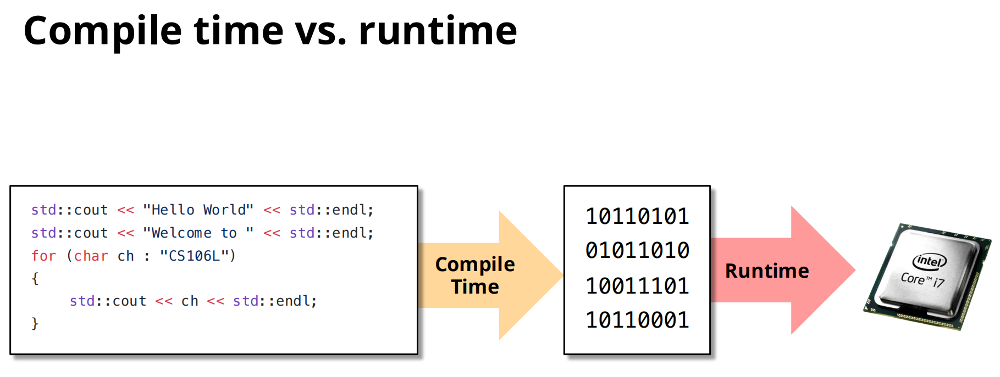
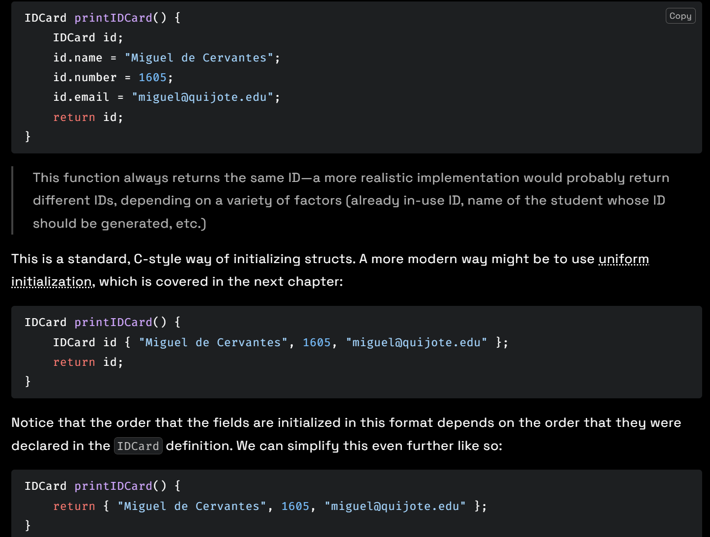
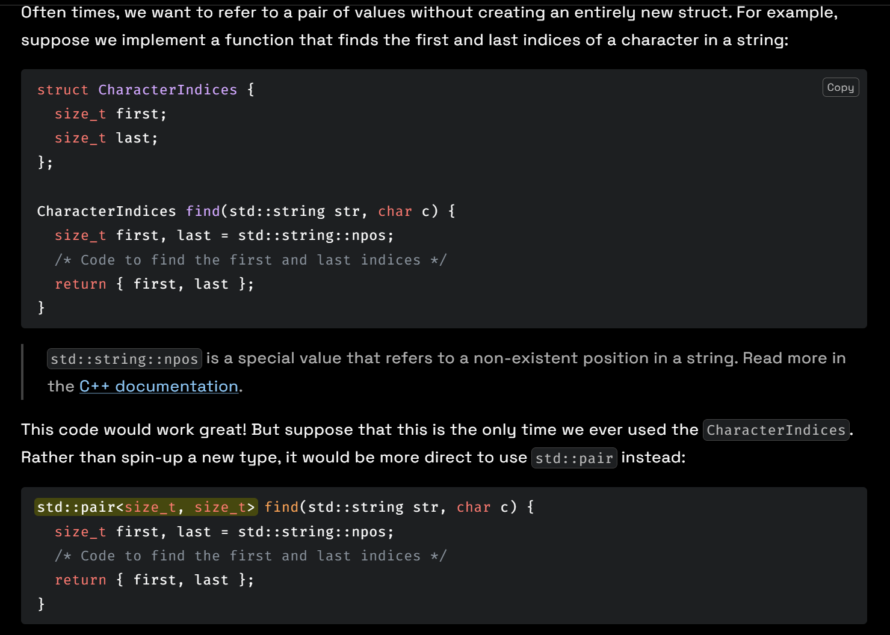

# Lec1: Types and Structs
## Intro to C++
### How Do We Run C++ Code?
Python is an interpreted language, while C++ is a compiled language.
This means that Python code is executed line by line, while C++ code is translated into machine code before execution.
This fundamental difference has implications for performance, development speed, and ease of debugging.
Compiling allows us to generate more efficient machine code, but compilation can be time-consuming and even make mistakes harder to debug.


## Types
A type refers to the category of data that a variable can hold.
C++ is a statically typed language, meaning that the type of a variable must be declared at compile time and cannot change during runtime.
`(int) x` casts x to an integer by dropping the decimal part.

## Structs
Similar to C structs.

If want to return a struct, this way is suggested.

### std::pair

std::pair is technically not a type, but a template.
When using pair, we must list the types of first and second inside the <> characters, e.g. std::pair<std::string, size_t>.
Templates will be discussed extensively in a later chapter.

### using Keyword
The `using` keyword allows us to create type aliases, making our code more readable and easier to maintain.
This is identical to the `typedef` keyword in C.
```cpp
using QuadraticSolution = std::pair<bool, std::pair<double, double>>;

QuadraticSolution solveQuadratic(double a, double b, double c);

int main() {
  QuadraticSolution soln = solveQuadratic(1, 2, 3);
  return 0;
}
```

### Type Deduction with auto
The `auto` keyword allows the compiler to automatically deduce the type of a variable based on the value it is initialized with.