# Final Review for C++

## 1.C++对C语言的扩充

### 栈

- 静态数据区：用于全局变量、static存储类的局部变量以及常量的内存分配。如果没有显示初始化，系统将自动把它们初始化成0。
- 代码区：用于存放程序的指令，对于C++而言，代码区存放的是所有函数的代码。
- 栈区：用于自动存储类的局部变量、函数的形参以及函数调用时的有关信息（函数返回地址等）的内存分配。
- 堆区：用于动态变量的内存分配。
- 栈空间被各个函数共享，从而节省空间。

### 内联函数

内联函数是指在定义函数时，在函数返回类型之前加上一个关键词**inline**.

内联函数的作用是**建议**编译程序把该函数的函数体展开到调用点，函数调用时直接执行函数体。
之所以是“建议”，是因为有些函数不适合展开，如递归函数，编译程序会忽略inline要求，按普通函数处理。

```cpp
inline int max(int x, int y)
{
    return x>y?x:y;
}
int z=max(a,b);
```

### 带缺省值的形式参数

在C++中允许在声明函数时，为函数的某些参数指定默认值。

```cpp
void print(int value, int base=10);
print(32,2); //32传给value；2传给base
print(28); //28传给value；10传给base， 是默认值
```

有默认值的形参应全处于形参表的右部。

```cpp
void f(int a, int b=1, int c); //Error，c没指定默认值
```

### 名空间作用域namespace

C++提供了**名空间**（namespace）机制来解决上述的名冲突问题
可以把全局标识符定义在一个名空间中，其作用域为该名空间。
当在一个名空间外部需要使用该名空间中定义的全局标识符时，需要用该名空间的名字来修饰或受限。

具有文件作用域的标识符可以用**无名的名空间**来定义。
例如，对于下面用static说明的具有文件作用域的全局变量：

```c
static int x,y; //C语言的做法
```

可以改写成：

```cpp
namespace
	{  int x,y; //x和y只能在本源文件中使用！
	}
```

**注意**：C++中，static有两个作用：

- 指定全局标识符具有文件作用域（可用无名的名空间替代）
- 指定局部变量具有静态生存期

### 动态变量

动态变量是指在程序运行中，由程序根据需要额外创建的变量，主要用于表示**元素个数可变**的复合数据，如链表、树等。
动态变量没有名字，需要通过指向它的**指针变量**来标识和访问它。
在c语言中我们使用malloc/free来创建和销毁动态变量
动态变量的创建使用**new**运算符，销毁使用**delete**运算符。

```cpp
int *p1; //p1是个指针变量
p1 = new int; //C++扩充，空间大小自动确定
int *p2; //p2是个指针变量
p2 = new int[n]; //C++扩充，创建一个有n个int型元素的数组
delete p1;
delete []p2; //由于p2指向的是一个数组，所以要加[]，否则只销毁第一个元素
```

**注意**：对于普通的动态变量，C++与C的做法区别不大，但如果创建的是**动态对象**，则两者是有差别的：
除了为对象分配空间外，new还会去调用对象类的**构造函数**进行对象初始化， malloc（calloc）则否。
除了收回为对象分配的空间外，delete还会去调用对象类的**析构函数**进行对象消亡后的清理工作，free则否。

### 引用类型

引用类型是用来给一个变量取一个别名，通过该别名可以访问原来的变量。

```cpp
int x;
int &y=x; //y为引用类型的变量，它是x的别名
y = 10;  //通过y访问x，效果上等价于：x = 10;
cout << x; //输出10
```

引用类型具有指针类型的一些效果，但语法不一样。引用主要用于函数的参数类型，实现指针类型参数的效果，但它比指针类型抽象和安全。

### 匿名函数：$\lambda$表达式

对一些临时使用的简单函数，可以把函数的定义和使用合二为一。
常用格式：
\[<环境变量使用说明>\](<形参>) -> <返回值类型> { <函数体> }
形参：加圆括号，如果没有参数这项可以省略。
返回值类型：如果函数体只有一条return语句，且返回值类型可以自动确定，这项可以省略。
**环境变量使用说明：**
指出函数体中对外层作用域中的自动变量的使用限制。

- 空：不能使用外层作用域中的自动变量
- &：按引用方式使用外层作用域中的自动变量，可以改变这些变量的值
- =：按值方式使用外层作用域中的自动变量，不能改变这些变量的值
- 变量名：前面可以加&或者=，默认加=，相当于指定特定的自动变量

**使用示例：**

```cpp
{ int k,m,n; //环境变量，在外层作用域中
   ......
   [](int x)->int { return x*x; }... //不能使用k、m、n
   [&](int x)->int { k++; m++; n++; 
               return x+k+m+n; }... //k、m、n可以被修改
   [=](int x)->int { return x+k+m+n; }...
					//k、m、n不能被修改
   [&,n](int x)->int { k++; m++; 
                         return x+k+m+n; }... //n不能被修改
   [=,&n](int x)->int { n++; return x+k+m+n; }... 
                                          //n可以被修改
   [&k,m](int x)->int { k++; return x+k+m; }...   
                                    //只能使用k和m，k可以被修改
   [=] { return k+m+n; }... //没有参数，返回值类型为int
			
}
```

λ表达式的使用方式：

- 直接调用它定义的函数。例如：

```cpp
[](int x)->int { return x*x; }(10)
```

- 把它定义的函数作为参数传给另一个函数。例如：

```cpp
void f(int (*fp)(int)) { ... fp(x) ... }
......
f([](int x)->int { return x*x; })
```

### 面向对象程序设计

面向对象程序设计（Object-Oriented Programming, OOP）
对OOP的完全支持是 C++ 最重要的特性之⼀。

## 2.抽象与封装

抽象：该程序实体**外部**可观察到的行为，使用者不考虑该程序实体的内部是如何实现的。（复杂度控制）
封装：把该程序实体**内部**的具体实现细节对使用者**隐藏起来**，只对外提供一个接口。（信息保护）

### 过程抽象与封装

- 过程抽象：用一个名字来代表一段完成一定功能的程序代码，代码的使用者只需要知道代码的名字以及相应的功能，而不需要知道对应的程序代码是如何实现的。
- 过程封装：把命名代码的具体实现隐藏起来（对使用者不可见或不可直接访问），使用者只能通过代码名字来使用相应的代码。命名代码所需要的数据是通过参数来获得，计算结果通过返回值机制返回。
  过程抽象与封装是基于功能分解与复合的过程式程序设计的基础。

### 数据抽象与封装

- 数据抽象：只描述对数据能实施哪些操作以及这些操作之间的关系，数据的使用者不需要知道数据的具体表现形式。（数组或链表等）
- 数据封装：把数据及其操作作为**一个整体** （封装体）来进行实现，其中，数据的具体表示被隐藏起来（使用者不可见，或不可直接访问），对数据的访问（使用）只能通过封装体对外**接口**中提供的操作来完成。
  数据抽象与封装是面向对象程序设计的基础，其中的对象体现了数据抽象与封装。

## 3.面向对象程序设计

- 程序由若干**对象**组成，每个对象是由一些**数据**以及对这些数据所能实施的**操作**所构成的**封装体**；
- 对数据的操作是通过向包含数据的对象**发送消息**（**调用对象对外接口**中的操作）来实现的，体现了数据抽象；
- 对象的特征（包含哪些数据与操作）由相应的**类**来描述；
- 一个类所描述的对象特征可以从其它的类**继承**（获得）。

对象构成了面向对象程序的**基本计算单位**，程序的执行体现为对象间的一系列**消息传递**

消息处理可分为两种方式：

* 同步消息处理：消息发送者必须等待消息处理完才能继续执行其它操作（顺序执行）。
* 异步消息处理：消息发送者不必等待消息处理完就能继续执行其它操作（并发执行）。

C++中，程序从函数main开始执行，第一条消息是从main中发出的。

### 面向对象程序设计的基本内容

**对象**是由数据以及能对其实施的操作所构成的封装体。
**类**描述了对象的特征（包含什么类型的数据和哪些操作），实现数据抽象。
对象属于值的范畴，是**程序运行时刻**的实体；类则属于类型的范畴，是**编译时刻**的实体。

继承是一种**代码复用**机制，它允许一个类（称为**派生类**）从另一个类（称为**基类**）那里继承数据和操作，可分为单继承和多继承。
多态：元素存在多种形式和解释

- 一名多用：函数名重载，操作符重载
- 类属：类属函数：一个函数能对多种类型的数据进行相同的操作。类属类型：一个类型可以描述多种类型的数据。

面向对象程序特有的多态（**继承机制带来的**）：

- 对象类型的多态：子类对象既属于子类，也属于父类。
- 对象标识的多态：父类的引用或指针可以引用或指向父类对象，也可以引用或指向子类对象。
- 消息的多态：发给父类对象的消息也可以发给子类对象，父类与子类可以给出不同的解释（处理）。

绑定(Binding)：确定对多态元素的某个使用是多态元素的哪一种形式。可分为静态绑定和动态绑定：

- 静态绑定（Static Binding）：在**编译时刻**确定。
- 动态绑定（Dynamic Binding）：在**运行时刻**确定。

## 4.类与对象

对象的特征要用相应的类来描述
class <类名> { <成员描述> } ;
成员包括：数据成员和成员函数。

- 在类中说明一个数据成员的类型时，如果未见到相应类型的定义，或者还没有定义完（如在Date中创造Date成员时，Date类还没有定义完，会递归），则该数据成员的类型只能是这些类型的**指针或引用类型**。
- 成员函数的实现可以放在类定义之外，如果函数体放在类定义中，默认建议编译器将其作为内联函数处理，所以适合小函数。

### 类的成员访问控制

在C++的类定义中，可以用下面的成员访问修饰符来控制外部对类成员的访问限制：

- public：访问不受限制
- private：只能在本类和友元的代码中访问
- protected：只能在本类、友元和派生类的代码中访问，为了继承服务而设的访问权限。

友元：与类密切相关，又不适合作为类的成员或者派生类的情况。

### 对象

类属于类型范畴的**程序实体**，它一般存在于静态的程序（编译程序看到的）中。
而动态的面向对象程序（运行中的）则是由**对象**构成。对象在程序运行时根据相应的类来创建。

### 对象的创建和标识

#### 直接方式

通过在程序中定义一个类型为类的变量来实现。对象在进入相应变量的生存期时创建，通过**变量名**来标识和访问。相应变量的生存期结束时，对象消亡。
分为：全局对象、局部对象。

#### 间接方式

在程序运行时刻，用 `new`操作符来创建对象（称为动态对象），用 `delete`操作符来撤消它（使之消亡）。动态对象需要通过**指针**来标识和访问。

### 成员对象

对于类的数据成员，其类型可以是另一个类。即一个对象可以包含另一个对象，后者称为成员对象。
成员对象跟随包含它的对象一起创建和消亡。

### 对象的操作

对象的操作（访问对象的数据）是通过向对象**发送消息**（调用对象类中定义的某个public成员函数）来实现的。
在类的外部访问类的成员时要受到**类成员访问控制**的限制。
同类对象之间的赋值：把一个对象的所有数据成员值赋给另一个对象的数据成员。

## 5.this指针

类的成员函数都有一个隐藏的参数，叫做 `this`指针，指向调用该成员函数的对象本身。
在编译成员函数时，会加上一个隐含的参数 `this`，它的类型是“指向所属类类型的指针”。

```cpp
void g(int n); //成员函数声明
//编译器把它改成下面这样
void g(ClassName *this, int n); //ClassName为所属类名
```

在调用的时候，比如调用 `a.g(1)`时，等价于 `g(&a, 1)`，`this`指针指向 `a`对象。
如果需要将this指针指向的对象本身传递给另一个函数，可以通过 `this`指针来实现。
this指针也可以用于返回对象本身的引用，从而实现成员函数的链式调用。
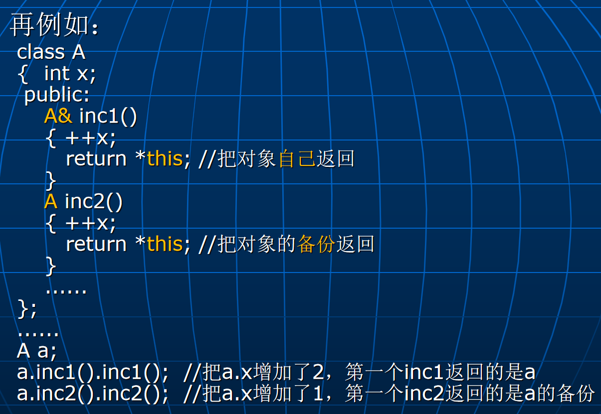

## 6.构造函数与析构函数

当一个对象创建时，它将获得一块内存空间，该内存空间用于存储对象数据成员的值。在使用对象前，需要对对象内存空间中的数据成员进行初始化。
在以前的C++中，无法在class中直接为数据成员赋初值，只能在构造函数中对数据成员进行初始化。

### 构造函数

特殊的成员函数，用于对象创建时对对象进行初始化，自动被调用，没有返回值，名字与类名相同，可以有多个构造函数（重载）。
在众多重载中，不带参数的构造函数称为**默认构造函数**，如果没有定义任何构造函数，编译器会自动生成一个默认构造函数。
通过类的构造函数也可以用来创建一些临时对象，对象创建之后不能再显式调用构造函数对对象进行初始化。

#### 成员初始化表

如何对const常量和引用类型的成员进行初始化？
可以在构造函数的函数头和函数体之间加入一个**成员初始化表**来对常量和引用数据成员进行初始化。

```cpp
class A
 {  int x;
	  const int y;
	  int& z;
  public:
	  A(): z(x),y(1)  //成员初始化表
	  { x = 0;
	  }
};
```

在成员初始化表中，成员的书写次序并不决定它们的初始化次序，它们的初始化次序由它们在**类定义中**的描述次序来决定。
次序为什么很重要？次序错误可能会引起程序错误。
比如如果后面的成员初始化表中用到了前面的成员，而前面的成员还没有初始化，就会引起错误。

### 析构函数

一个对象**消亡**时，系统在收回它的内存空间之前，将会自动调用对象类中的析构函数。
析构函数的名称是在类名前加上一个波浪号（~），它不带任何参数，也没有返回值。
可以在析构函数中完成对象被删除前的一些清理工作。
一般情况下，类中不需要自定义析构函数，但如果对象创建后，自己又**额外申请了资源**（如：额外申请了内存空间），则可以自定义析构函数来归还它们。
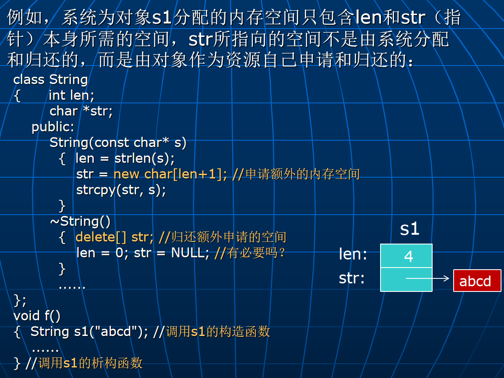
析构函数除了在对象消亡时会被自动调用外，也可以在对象生存期内**显式调用**，这与构造函数不同。
这时并不是让对象消亡，而是**暂时归还**对象额外申请的资源。
因此，在析构函数中将成员变量设为空值（如int型设为0）并且将指针成员置为NULL是一个好习惯。

在创建包含成员对象的对象时，除了会自动调用本身类的构造函数外，还会**自动去调用成员对象类的构造函数**，析构函数也是如此。
如果要调用成员对象类的非默认构造函数，需要在包含成员对象的对象类的构造函数**成员初始化表**中显式指出

包含成员对象的对象创建时，

- 先调用**本身类**的构造函数，但在**进入函数体之前**，会去调用**成员对象类**的构造函数，**然后再执行**本身类构造函数的函数体！
- 也就是说，构造函数的成员初始化表（即使没显式给出）中有对成员对象类的构造函数的调用代码，是编译器加上的
- 若包含多个成员对象，这些成员对象构造函数的调用次序则按它们在**本对象类中的说明次序**进行。
- 析构函数的调用次序与构造函数的调用次序相反。
- 先调用**本身类**的析构函数，本身类析构函数的函数体**执行完之后**，再去调用成员对象类的析构函数！
- 也就是说，析构函数的函数体最后有对成员对象类的析构函数的调用代码！
- 如果有多个成员对象，则成员对象析构函数的调用次序按它们在本对象类中的说明次序的**逆序**进行。

## 7.对象的拷贝与转移初始化

### 拷贝构造函数

在创建一个对象时，如果用另一个同类的对象对其进行初始化，将会去调用对象类中的一个特殊构造函数--拷贝构造函数。
拷贝构造函数的参数类型为本类的引用。
拷贝构造函数的参数必须是引用类型，否则会导致无限递归调用，因为创造拷贝的时候就需要调用拷贝构造函数。

```cpp
class A
{	......
	public:
		A();  //默认构造函数
		A(const A& a);  //拷贝构造函数
}; 
```

在下面三种情况下，会去调用拷贝构造函数：

1. 创建对象时显式指出用另一个同类对象**对其初始化**。
2. 把对象作为**值参数**传给函数，先创造形式参数的对象，再调用拷贝构造函数来初始化。
3. 把对象作为函数的**返回值**时，先创造返回值的对象，再调用拷贝构造函数来初始化。

如果在类中没有定义拷贝构造函数，编译器会自动生成一个默认的拷贝构造函数，按成员逐一拷贝。
对成员对象，调用其拷贝构造函数，类似递归。
一般情况下，编译程序提供的隐式拷贝构造函数的行为足以满足要求，类中不需要自定义拷贝构造函数。
但在一些特殊情况下，必须要自定义拷贝构造函数，否则，将会产生设计者未意识到的严重程序错误。

```cpp
class String
{	   int len;
	   char *str;
	public:
		String(const char *s) 
		{ len = strlen(s); 
		   str = new char[len+1]; 
		   strcpy(str,s); 
		}
		~String() { delete []str; len=0; str=NULL; }
};
......
String s1("abcd");
String s2(s1);
```

隐式的拷贝构造函数将会使得s1和s2的成员指针str指向**同一块内存区域**！
可能引起的问题：

- 如果对一个对象（s1或s2）操作之后修改了这块空间的内容，则另一个对象（s1或s2）也会受到影响。
- 当对象s1和s2消亡时，将会分别去调用它们的析构函数，这会使得同一块内存区域将被归还两次，从而导致程序运行错误。

系统提供的隐式拷贝构造函数实施的是**浅拷贝**（shallow copy）：对于指针成员，只拷贝**指针的值**，**不拷贝它指向的值**。

为了解决上面的问题，可以在类String中自定义一个拷贝构造函数来实现**深拷贝（deep copy）**

```cpp
String::String(const String& s)
{	len = s.len;
	str = new char[len+1]; //申请一块新空间
	strcpy(str,s.str); //拷贝指针指向的值
}
```

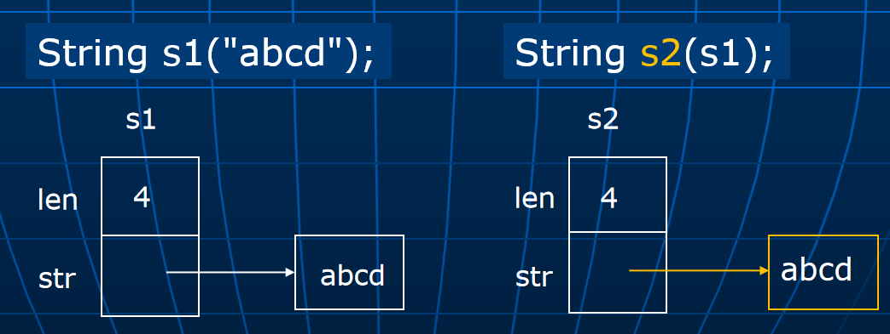

注意：自定义的拷贝构造函数**不会自动调用**成员对象类的**拷贝构造函数**，而是调用成员对象类的**默认构造函数**。
必须在自定义拷贝构造函数的成员初始化表中显式指出调用成员对象类的拷贝构造函数。

### 转移构造函数

当用一个**临时或即将消亡**的对象去初始化另一个同类的对象时，自定义的拷贝构造函数的效率有时是不高的。

```cpp
class A
{ char *p;
public:
  A(const char *str) 
  { p = new char[strlen(str)+1]; //申请内存空间
     strcpy(p,str); 
  }
  A(const A& x) //拷贝构造函数
  { p = new char[strlen(x.p)+1]; //申请内存空间，避免指向同一个地址
     strcpy(p,x.p); //内容复制
  }
  ~A() 
  { if (p != NULL) delete[]p; //归还内存空间
     p = NULL; 
  }
  void g() { ...... }
};
```

在编译器没有优化的情况下，下面的代码效率不高：

```cpp
A f()
{ A t("1234"); //创建局部对象t(调用构造函数申请空间)
   ......
   return t; //创建返回值对象(调用拷贝构造函数申请空间,内容复制)
                //然后，局部对象t消亡（调用析构函数归还t申请的空间）
}
int main()
{ ......
   f().g();   //使用函数f的返回值对象，然后，
                //该返回值对象消亡（调用析构函数归还空间）
   ......
}
```

函数f中，局部对象t在调用拷贝构造函数时，**申请了两块内存空间**，也就是一次返回值对象，一次局部对象t，而且还要进行一次内容复制。
在函数f返回时，局部对象t消亡，调用析构函数归还t申请的空间。
为什么不直接将t申请的空间**转移**给返回值对象的空间呢？这样可以省去返回值对象申请空间、内容复制以及对象t消亡归还空间的开销。

#### 返回值优化(Return Value Optimization, RVO)

当函数返回一个对象时，有些情况下，编译器会进行返回值优化。
例如，在编译器优化的情况下，刚才的“return t;”不会创建返回值对象，而是直接把t返回：
**问题**：t是局部对象，函数返回后其生存期就结束了，应该是不能再使用它的，那优化是如何实现的？如何保证函数返回之后t的空间仍然有效？

如果函数的返回值是基本数据类型（int、char、float、double等），会在cpu寄存器中分配空间来存放返回值。
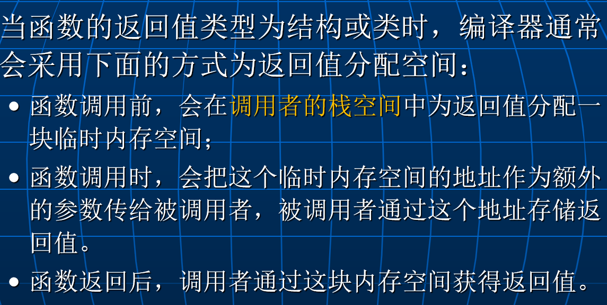
如果函数把一个与返回值**同类型**的局部对象（如前面例子中的对象t）返回，编译器有时会**优化**这个局部对象的空间分配：

- 先在调用者的栈空间中为返回值对象分配空间，然后不额外为局部对象t分配空间，而是把返回值对象的空间分配给它。
- 这样，返回值对象与这个局部对象就是**同一个对象**，函数返回时直接把这个局部对象返回，而不会去调用拷贝构造函数再创建返回值对象。
- 由于这个局部对象的空间是在**调用者的栈空间中**，函数返回后，它仍然有效！

如果函数中有**多个**与返回值同类型的局部对象，并且函数中**根据不同的情况返回不同的局部对象**，则编译器**无法进行返回值优化**！函数返回时仍然会创建返回值对象，并调用拷贝构造函数对其进行初始化。

在这种情况下，还想提高效率，可以使用**转移构造函数**。

#### 转移构造函数

可以在类中定义一个转移构造函数(move constructor)，其参数类型为本类的右值引用。

```cpp
A(A&& x); //参数为本类的右值引用类型：&&
```

右值引用：只接受右值，也就是临时对象或者即将消亡的对象。
当用一个临时对象或即将消亡的对象去初始化另一个对象时，将会去调用**转移构造函数**进行对象初始化。
**注意**：如果对象类中没有自定义转移构造函数，系统不会提供隐式转移构造函数！
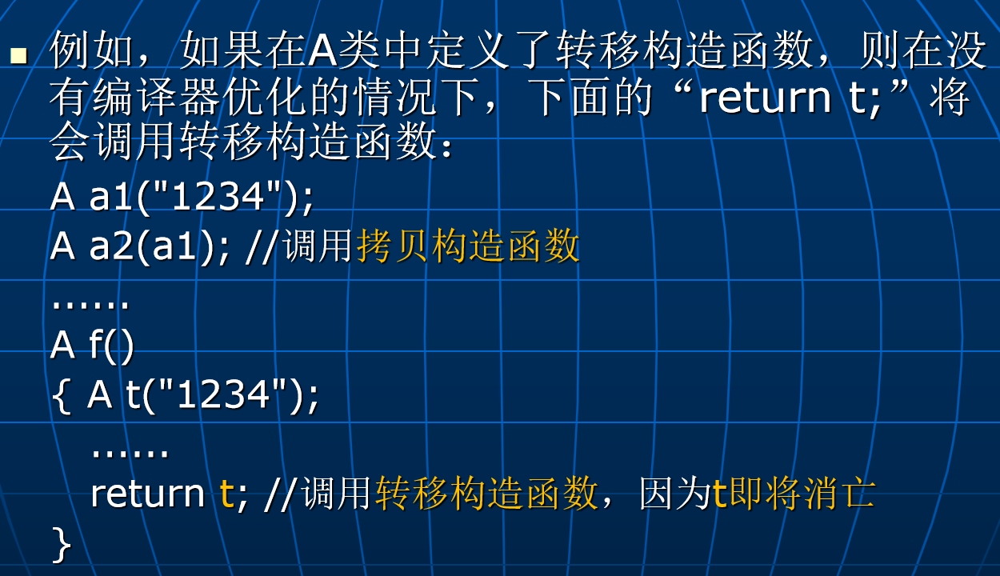
可在转移构造函数中实现资源的转移。例如：

```cpp
A(A&& x)
{ p = x.p; //把参数对象x的p所指向的空间作为
               //新对象的p所指向的空间（资源转移）
   x.p = NULL; //使得参数对象x的p不再指向原来的空间，防止他析构的时候归还这块空间
}
```

这块跟拷贝构造不同，拷贝构造没有资源转移，而是资源复制，他并没有把原来所指的空间设为null。
有了上述的转移构造函数之后，前面例子中的“return t;”就会去调用它，从而实现：

- 不再为返回值对象额外申请空间和内容复制
- 对象t消亡时也不再归还原来申请的空间

如何把一个左值对象的资源转移给另一个对象？
可以用STL中的函数move把一个左值类型转换成右值类型。例如：

```cpp
#include <utility> //包含move函数的头文件
void f(A x) { ...... }
......
A a; //a为一个左值对象
f(a); //用拷贝构造创建x，a的资源仍然存在
f(std::move(a)); //把a转成右值的时候，就会用转移构造创建x
			     //a不再拥有资源！
```

move函数**并不真的移动什么东西**，它只是把一个**左值转换成右值**，从而使得这个对象可以调用转移构造函数。

## 8.常成员函数及静态成员

### 常成员函数

为了防止在一个获取对象状态的成员函数中无意中修改对象数据成员的值，可以把它说明成**常成员函数**。
常成员函数在声明时，在函数名后面加上 `const`关键字。

```cpp
class Date
{	public:
		void set(int y, int m, int d); 
	  int get_day() const; //常成员函数
     int get_month() const; //常成员函数
     int get_year() const; //常成员函数
  ......
}; 
void Date::set(int y, int m, int d) { year=y; month=m; day=d; }
int Date::get_day() const { return day; }
int Date::get_month() const { return month; }
int Date::get_year() const { return year; }
```

编译器一旦发现在常成员函数中修改数据成员的值，就会报错。
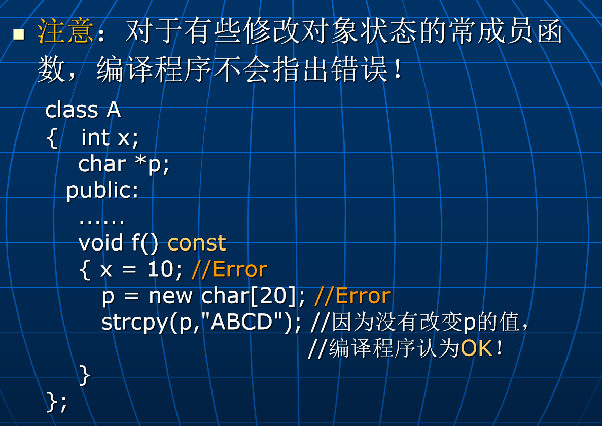
只修改了p指向的值，没有修改p本身的值，编译器不会报错。
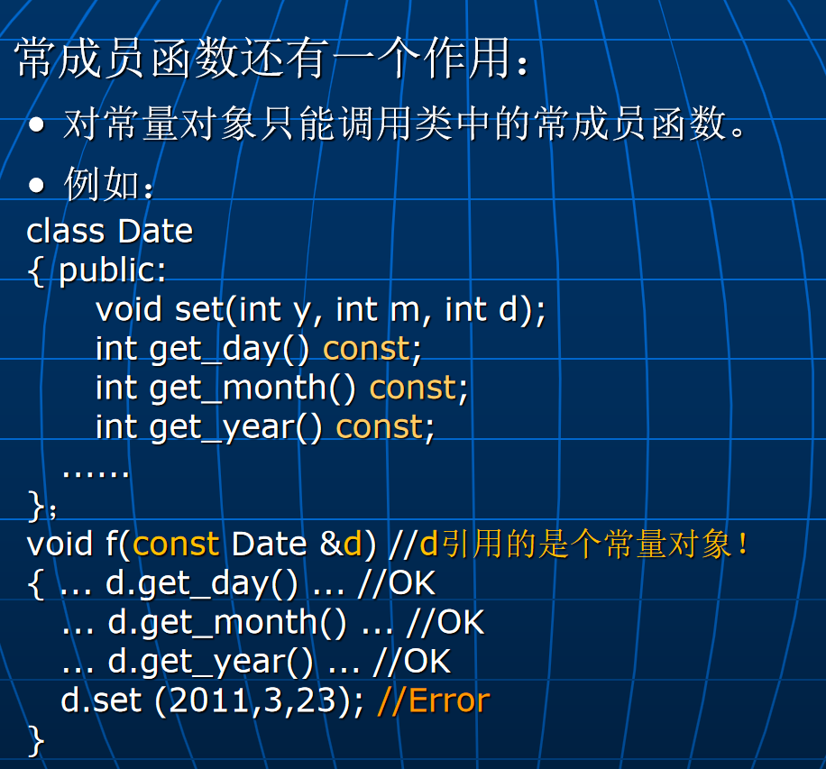
这里，d这个对象是一个常对象，只能调用他的常成员函数。

### 静态成员

```cpp
class A
{ int y;
   ......
   static int x; //x是静态数据成员（这里是声明），它表示共享的数据
   void f()   { y = x; x++; ......   } //访问共享的x
};
int A::x=0; //静态数据成员的定义及初始化
......
A a,b;
a.f();
b.f();
//上述操作中使用的是同一个x！
x++; //Error，不通过A类对象不能访问x！
```

注意：类的静态数据成员对该类的**所有对象只有一个拷贝**，被所有对象共享。
非静态的数据成员，每个对象都有自己的拷贝。
静态数据成员，在类外定义时**必须初始化**。

### 静态成员函数

```cpp
lass A
{		int x,y;
		static int shared;
	public:
		A() { x = y = 0; }
		static int get_shared() //静态成员函数
     { return shared; 
     }
		......
};
int A::shared=0;
```

静态成员函数**只能访问静态数据成员**，不能访问非静态数据成员，并且没有隐藏的**this**指针。

静态成员除了通过对象来访问外，也可以直接通过类来访问。

```cpp
A a;
a.get_shared();//通过对象访问
A::get_shared();//通过类访问
```

可以把类看成是对象，那么类对象的类又是什么？
把类中**所有非静态成员去掉**后得到的类就是类对象所属的类。

## 9.友元

类中定义的数据成员在外界不能直接访问，需要通过类的public成员函数来访问。
但是在有些情况下，这种访问方式**效率不高**。

为了提高访问效率，可以指定某些与一个类**密切相关**，又**不适合作为该类的一个成员**的程序实体，称为**友元**，可以直接访问该类的**非public数据成员**。

友元需要在类中用**friend**关键字来声明，他们可以是：

- 其他类的所有成员函数
- 其他类的某个成员函数
- 全局函数

```cpp
class A
{	......
	friend void func();  //全局函数func可访问x
	friend class B;  //类B的所有成员函数可访问x
	friend void C::f();  //类C的成员函数f可访问x
private:
   int x;
}; 
```

对友元的说明：

- 友元不是本类的成员
- 友元具有不对称性
- 友元不具有传递性

## 10.类作为模块

### 模块

从**物理上**对程序中定义的实体进行分组，是可以单独编写和编译的程序单位。
模块化是组织和管理大型程序的一个重要手段。

一个模块往往包含**接口和实现**两个部分

- 接口：是指在模块中定义的、可以被其它模块使用的一些程序实体的**声明描述**。
- 实现：是指在模块中定义的所有程序实体的具体**实现描述**。

### C语言中模块构成

- 接口：包含被外界使用的类型和常量的定义以及函数和全局变量的声明。放在.h文件中，称为**头文件**。
- 实现：包含本模块中所有的类型、常量、全局变量和函数的定义。放在.c文件中，称为**源文件**。

模块的使用者可以用**编译预处理命令** `#include`把该模块的头文件（.h）包含进使用者的源文件中，从而达到对使用的实体进行声明的目的。

### 如何划分模块

如何确定一个程序实体放在哪个模块中？
基本准则：

- 内聚性最大：模块**内**的各实体之间**联系紧密**。
- 耦合度最小：模块**间**的各实体之间**关联较少**。

#### 过程式程序的模块划分

比如C语言程序。划分比较模糊。
通常基于子程序（C语言中的函数）进行划分：

- 共同完成某独立功能的子程序及相关的实体
- 使用相同数据的子程序及相关的实体

但是模块边界模糊，一个子程序可能参与多个功能，也可能使用多个数据集，无法确定一个子程序应该放在哪一个模块中。

#### 面向对象程序的模块划分

类是自然的模块划分单位，一个类构成一个模块，边界比较清晰。
C++程序的一个模块由两部分构成：

- 接口：**类的定义**，按C语言的做法，可存放在一个.h文件中
- 实现：**类的实现**（包括类的定义和在类外定义的成员函数），按C语言的做法，可存放在一个.cpp文件中。
  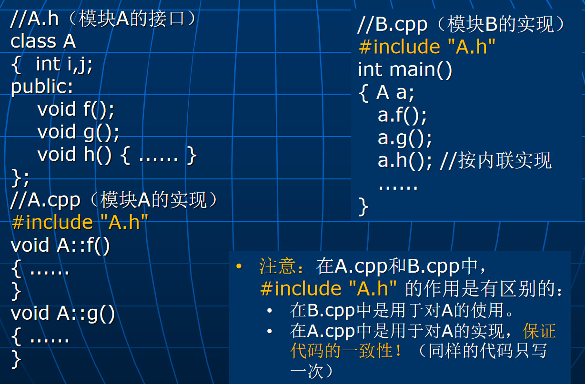
  #include就是可以把代码直接包含进来，就像copy paste一样，但是如果你要修改就只用改一次，不容易出错

### 良好的面向对象程序设计风格

**结构化程序设计**为**过程式程序**设计提供了一种良好的风格指南，它要求每个程序单位都应该具有“**单入口/单出口**”性质，使得各程序单位相对独立,**耦合度较小**
具体表现为不使用goto，只使用**顺序、选择、循环**三种基本结构，并且使用子程序。

良好的面向对象程序设计风格是什么呢？

**Demeter法则**
一个类的成员函数：

- 只能访问自身类结构的**直接子结构**（本类的数据成员），不能以任何方式依赖于任何其它类的结构（其它类的数据成员）。
- 只应向某个有限集合中的对象发送消息。

核心思想：**“仅与你的直接朋友交谈！”**

这样，可以减少类之间的关联度（耦合度），对类中成员函数能访问的其它类/对象的集合作一定的限制，尽量使该集合为最小。

#### Demeter法则的类表达形式和对象表达形式

类表达形式：限制一个类的成员函数访问的类的集合最小
对象表达形式：限制一个类的成员函数访问的对象的集合最小

## 11.操作符重载

### 操作符重载的实现途径

操作符重载可通过定义一个函数名为“operator #”（ “#”代表某个**可重载**的操作符）的函数来实现，该函数可以作为：

- 一个类的成员函数。
- 一个全局（友元）函数。

```cpp
class Complex
{	public:
		Complex operator + (const Complex& x) const//参数是一个Complex对象的引用，返回一个Complex对象
		{	Complex temp;
			temp.real = real+x.real;
			temp.imag = imag+x.imag;
			return temp;
		}
    ......
};
……
Complex a(1.0,2.0),b(3.0,4.0),c;
c = a + b; //按 a.operator+(b) 实现
```

这个是以成员函数实现的重载，也可以以全局函数实现：

```cpp
class Complex
{	......
	friend Complex operator + (const Complex& c1, 
					           const Complex& c2);//要声明成friend，因为要访问private成员
};
Complex operator + (const Complex& c1, 
				        const Complex& c2)
{	Complex temp;
	temp.real = c1.real + c2.real;
	temp.imag = c1.imag + c2.imag;
	return temp;
}
……
Complex a(1.0,2.0),b(3.0,4.0),c;
c = a + b; //按 operator+(a,b) 实现
```

### 操作符重载的基本原则

只能重载C++语言中**已有的操作符**，不可臆造新的操作符。
可以重载C++中除下列操作符外的所有操作符：“.”， “.*”，“?:”，“::”，“sizeof”
需要遵循已有操作符的**语法**：不能改变**操作数的个数**，并且原操作符的**优先级和结合性**不变。
尽量遵循已有操作符原来的**语义**：语言本身没有对此做任何规定，使用者自己把握

作为全局函数重载操作符时，至少要有一个参数为类、结构、枚举或它们的引用类型，并且该全局函数往往要说明成相应类、结构、枚举的**友元**，因为基本数据类型语言编译器已经重载好了。**成员函数不需要**，因为成员函数有一个隐藏的this指针。

### 双目操作符重载

#### 作为**成员函数**重载

只需要提供一个参数，它对应第二个操作数（第一个操作数则由隐藏的参数 `this`给出）。

```cpp
class Complex
{		double real, imag;
	public:
		......//判断复数的等于和不等于
		bool operator ==(const Complex& x) const
		{	return (real == x.real) && (imag == x.imag);
		}
		bool operator !=(const Complex& x) const
		{	return (real != x.real) || (imag != x.imag);
		}
        //最好写成下面这样，因为如果==的逻辑又改变了，只需要改一个函数就行
        bool operator !=(const Complex& x) const
		{	return !(*this == x);
		}
};
......
Complex c1,c2;
...... 
if (c1 == c2) //或 if (c1 != c2)
```

#### 作为**全局函数**重载

需要提供**两个参数**，其中至少应该有一个是类、结构、枚举或它们的引用类型。

```cpp
class Complex
{		double real, imag;
	public:
		Complex() { real = 0; imag = 0; }
		Complex(double r, double i) { real = r; imag = i; }
		......
        //重载操作符+，使其能够实现实数与复数的混合运算。 
	friend Complex operator + (const Complex& c1, 
							    const Complex& c2);
	friend Complex operator + (const Complex& c, 
 							    double d);
	friend Complex operator + (double d, 
							    const Complex& c);
};

Complex operator + (const Complex& c1, 
				      const Complex& c2)
{	return Complex(c1.real+c2.real,c1.imag+c2.imag);
}
Complex operator + (const Complex& c, double d)
{	return Complex(c.real+d,c.imag);
}
Complex operator + (double d, const Complex& c)
//“实数+复数”只能作为全局函数重载。为什么？因为如果作为成员函数重载，
//则第一个操作数必须是Complex对象，而不是double类型的实数。
{	return Complex(d+c.real,c.imag);
}
......
Complex a(1,2),b(3,4),c1,c2,c3;
c1 = a + b;
c2 = b + 21.5;
c3 = 10.2 + a;
```

### 下标访问操作符“[]”的重载

“[]”是一个双目操作符，第一个操作数为一个数组或指针，第二个操作数为一个整型数，操作结果为数组元素

对于一个由具有**线性关系的成员**所构成的对象，可通过重载下标访问操作符“[]”来实现**对其成员的访问**。

```cpp
class String
{	 int len;
	 char *str; //指向一个存储字符串的内存空间
    public:
 		......
		char &operator [](int i) {	return str[i]; }
		char operator [](int i) const { return str[i];} //用于常量对象
};
......
String s("abcd");
cout << s[0];  //输出：a
s[0] = 'A';
cout << s[0];  //输出：A
```

```cpp
class Vector  //向量类
{	   int *p_data;
	   int num;
	public:
		......
		int& operator[](int i) //访问向量第i个元素。
		{	return p_data[i];
		}
};
......
Vector v(10);
v[2] = 23;
cout << v[2]; //输出：23
```

如果要访问矩阵的元素，不能直接重载 `[][]`，怎么办？
重载 `[]`运算符，返回一个向量类型，再把向量的 `[]`也重载了，就可以用m[2][3]访问m的第二行第三列。

### 单目操作符重载

略

### 特殊的单目操作符++和--

他们的操作数必须是**左值**，不能是临时单元中的右值。
而前缀++和--返回的是操作数的引用，后缀++和--返回的是操作数的副本，副本是右值存在于一个临时单元之中。
所以++(++x)和(++x)++是可以的，但是(x++)++和++(x++)是错误的。
也就是说++x的结果是一个左值，而x++的结果是一个右值。

区分操作数和操作结果，就可以很容易理解前缀和后缀的区别。

### 自定义类型转换操作符

可以通过操作符重载来实现**从一个类到其它类型的转换**。

```cpp
class A
{  int x,y;
  public:
   ......
   operator int() //用于把A类型的对象转换成int类型
   { return x+y; 
   }
};
...
A a;
int i=1;
... (i + a) ... //将调用类型转换操作符重载函数operator int()
			   //把对象a隐式转换成int型数据。
```

### 歧义问题

```cpp
class A
{		int x,y;
	public:
		A() { x = 0;  y = 0; }
		A(int i) { x = i; y = 0; }
      A(int i,int j) { x = i;  y = j; }
		operator int() { return x+y; }
	friend A operator +(const A &a1, const A &a2);
};
......
A a;
int i=1;
... (a + i) ...  //是把a转换成int呢，还是把i转换成A呢？
```

对于这样的情况，可以用显式类型转换来解决：

```cpp
... ((int)a + i) ... //把a转换成int
... (a + (A)i) ...  //把i转换成A
```

也可以通过给A类的构造函数A(int i)加上一个修饰符 `explicit`，禁止把它用于隐式类型转换：

```cpp
class A
{		int x,y;
	public:
		A() { x = 0;  y = 0; }
		explicit A(int i) { x = i; y = 0; }
      A(int i,int j) { x = i;  y = j; }
		operator int() { return x+y; }
	friend A operator +(const A &a1, const A &a2);
};
```

当然，也可以给int类型转换操作符重载函数加一个 `explicit`，禁止其用作隐式类型转换，此处不再赘述。

## 12.对象的赋值与转移赋值

### 赋值操作符 `=`的重载

同一个类的两个对象如何赋值？
C++编译程序会为每个类定义一个**隐式的赋值操作**，其行为是：逐个成员进行赋值操作。对于普通成员，它采用常规的赋值操作。对于成员对象，则调用该成员对象类的赋值操作。

针对像 `string`这样的类，隐式的赋值操作会指向**同一个空间**，导致错误，因此需要重载赋值操作符。

```cpp
class String
{  ......
String& operator = (const String& s) //赋值操作符=的重载
    {	if (&s == this) return *this;  //防止自身赋值：a=a
	delete []str; //归还str原来指向的空间，防止内存泄漏
	str = new char[s.len+1]; //申请新的空间
	strcpy(str,s.str); //把用于赋值的字符串复制到新空间中
    len = s.len; 
	return *this;
    }
};
```

这个重载函数的返回值类型为什么是 `String&`而不是 `void`？因为赋值操作符 `=`的返回值是一个左值，可以出现在赋值语句的左边，例如：

```cpp
String a("hello"), b("world"), c("cpp");
a = (b = c); //为了实现这种连锁赋值，赋值操作符必须返回一个左值引用
```

注意：如果有成员对象，**自定义的**赋值操作符重载函数**不会**自动去调用成员对象类的赋值操作，需要在自定义的赋值操作符重载函数中**显式指出**。

```cpp
class A { ...... };
class B
{		A a;
		int x,y;
	public:
		......
		B& operator = (const B& b)
		{	if (&b == this) return *this; 
            a = b.a;//显式调用A类的赋值操作符重载函数，实现成员对象的赋值。
			x = b.x;
			y = b.y;
			return *this;
		}
}; 
```

注意：要区别下面两个“=”的不同含义。

```cpp
A a;
A b=a; //初始化，等价于：A b(a);，调用拷贝构造函数。
......
b = a; //赋值，调用赋值操作符重载函数。
```

为了区分这两种=的不同含义，建议初始化的时候使用括号或大括号，赋值的时候使用等号。
一般来讲，需要**自定义拷贝构造函数**的类通常也需要**自定义赋值操作符重载函数**。

当用于赋值的对象（等号右边的对象）是一个**临时或即将消亡的对象**时，目前的赋值操作符重载函数的实现效率有时是不高的。

```cpp
class A
{ char *p;
public:
    A(const char *str) 
    { p = new char[strlen(str)+1]; //申请空间
        strcpy(p,str); 
    }
    ~A() { if (p!=NULL) delete[]p; p = NULL; } //释放空间

    A& operator=(const A& x) //赋值操作符重载函数
    { if (&x == this) return *this; 
      if (p != NULL) delete []p; //归还老空间
      p = new char[strlen(x.p)+1]; //申请新空间
      strcpy(p,x.p); //内容复制
      return *this; 
    }
  ......
};


A f(); //返回一个A类的临时对象，会额外申请空间
int main()
{ A a("abcd"); //调用构造函数为a额外申请空间
   a = f();  //把f的返回值对象赋值给对象a，返回值对象消亡
             //1. 调用赋值操作符重载函数：为a归还老空间、
	    //    申请新空间并进行内容复制
	    //2. 函数f返回值象消亡，调用析构函数归还它的空间
} //对象a消亡，调用析构函数为a归还空间
```

为何效率不高？
因为 `f()`的返回值对象是一个临时对象，调用赋值操作符重载函数时，必须为 `a`**归还老空间**、**申请新空间**并进行**内容复制**。
而实际上 `f()`的返回值对象马上就要消亡了，完全可以直接把它的空间“转移”给 `a`，而不需要进行内容复制。

### 转移赋值操作符重载函数

为了解决前面的赋值效率不高的问题，可以定义一个**转移赋值操作符重载函数**（move assignment operator）。
类比转移构造函数。

```cpp
A& operator=(A&& x) //参数为右值引用类型：&&
```

当用于赋值的对象是一个临时的或即将消亡的对象时，

- 如果对象类中**有**转移赋值操作符重载函数，则会去调用它来实现对象的赋值。
- 否则将调用**普通的**赋值操作符重载函数来实现对象的赋值。
  注意：系统**不会提供隐式的**转移赋值操作符重载函数！

```cpp
A& operator=(A&& x)
{ if (p != NULL) delete []p; //归还老空间
   p = x.p; //使用参数对象的空间（资源转移）
   x.p = NULL; //使得参数对象不再拥有原来的空间
   return *this; 
 }
```

这样可以省去申请新空间、内容复制的过程，提高了效率。

### 转移构造与转移赋值联合作用

A类中假设都定义了转移构造函数和转移赋值操作符重载函数

```cpp
A f()
{ A t("1234"); //t中申请空间
   ......
   return t;   //t中申请的空间转移到返回值对象中，调用转移构造函数
}
int main()
{ A a="abcd";
   ......
   a = f(); //赋值操作，调用转移赋值操作符重载函数
   ......
}
```

## 13.函数对象

### 函数调用操作符()的重载

可以针对某个类重载函数调用操作符，使得相应类的**对象可以当作函数来使用**。

```cpp
class A
{		int value;
	public:
		A(int i) { value = i; }
     int g() { return value; }
		int operator () (int x,int y) //函数调用操作符()的重载函数
		{ return x*y+value; }
};

A a(1); //a是个对象
cout << a.g() <<endl; //把a当对象来用
cout << 10+a(10,20) << endl; //把a当函数来用！
				//a(10,20)等价于：a.operator()(10,20)


void func(A& f) //f是个对象
{ ... 10+f(10,20) ... //把f当函数来使用
                     //f(10,20)等价于：f.operator()(10,20)
}
func(a); //把对象a传给f
```

### 函数对象

函数调用操作符重载主要用于**具有函数性质的对象**（称为：函数对象，functor）。
函数对象通常只有一个操作，可用**函数调用操作符重载函数**来表示该操作。
函数对象除了具有一般函数的行为外，它还可以拥有状态（由对象的数据成员来存储）。

例如，下面定义了一个幂函数类：

```cpp
class PowerFunc
{ int exponent;
public:
    PowerFunc(int n) { exponent=n; }
    double operator ()(double x)
    {   double power=1;
        for (int i=exponent; i>0; i--) power*=x;
        return power;
    }
};

PowerFunc square(2),cube(3);//创建两个函数对象：x^2和x^3，从语法上，是创建了两个对象，但是我们可以当做函数来用
int a;

cout << square(a) << cube(a); //计算a2和a3
```

再例如，下面定义了一个能生成随机数的对象类：

```cpp
class RandNumGen
{	  unsigned int seed; //状态
	public:
   	  RandNumGen(unsigned int i) { seed = i; }
	  unsigned int operator ()() //函数调用操作符重载，前一个（）表示函数调用操作符，后一个（）表示参数列表为空
   	  { seed = (25173*seed+13849)%65536; //修改了状态
	     return seed;
     }
};

RandNumGen rand_num(1); //创建一个函数对象，seed初值为1
... rand_num() ... //调用它表示的函数生成一个随机数
```

### $\lambda$表达式

C++中，$\lambda$ 表达式是通过函数对象来实现的。
例如，对于下面的λ表达式：

```cpp
	[...](int x)->int { ....... }
```

编译器：
首先，隐式定义一个类：
数据成员对应λ表达式中用到的环境变量（[...]），在构造函数中用环境变量对它们进行初始化。
按相应λ表达式的函数功能（即{}中的内容）重载了函数调用操作符。

然后，创建上述类的一个临时对象（设为obj）
最后，在使用上述λ表达式的地方用obj来替代，作用于实参进行函数调用

对于：cout << [...](int x)->int { ....... }(3);
替换成：cout << obj(3);
传给其它函数
对于：f([...](int x)->int { ....... });
替换成：f(obj);

## 14.动态对象空间的自动回收（智能指针）

### 智能指针

可以针对某个类重载“->”、“*”等**用于指针的操作符**，这样就可以把该类的对象当指针来用，实现一种智能指针（smart pointers）。
例如，下面的B类中重载了操作符“->”：

```cpp
B b=&a; //或B b(&a); b是个智能指针对象，它指向a
b->f(); //把b当指针来用（通过b访问对象a的成员f）
```

- 通过智能指针去访问它指向的对象之前能做一些额外的事情。（**在操作符重载函数中实现**）
- 通过智能指针可以**管理**它指向的对象空间，实现动态对象空间的**自动回收**。

### 间接类成员访问操作符“->”的重载

“->”为一个双目操作符：

- 第一个操作数为一个指向类或结构的**指针**。
- 第二个操作数为第一个操作数所指向的类或结构的**成员**。

p->m 等价于 (*p).m，即先对p解引用，得到一个类或结构的对象，然后访问该对象的成员m。

需求：通过一个函数访问某个对象的成员，如何知道在该函数中访问了该对象的成员多少次？

```cpp
class A
{		int x,y;
	public:
		void f();
		void g();
};
void func(A *p) //p是一个普通指针
{  ...... p->f(); ...... p->g(); ...... //通过p访问对象a的成员
}
......
A a;
func(&a); //调用func，a传给它
...... //调用完func后，如何知道在func中访问了a的成员多少次？
```

第一种解决方案：在类A中加一个计数器count，在构造函数中把它初始化为0，在每个成员函数中把它加1

```cpp
class A
{	int x,y;
	int count;
public:
    int z;
	A() { count = 0; ... }
	void f() { count++; ... }
	void g() { count++; ... }
	int num_of_access() const { return count; }
};
void func(A *p) {  ...... p->f(); ...... p->g(); ...... p->z; }
......
A a;
func(&a);
... a.num_of_access() ... //获得对a的访问次数
```

缺点：需要修改类A的定义，增加了类A的复杂性。并且，如果类A中有外界可访问的数据成员（如z），无法对其访问进行计数！

更好的解决方案：定义一个智能指针类

```cpp
class PtrA  //智能指针类
{		A *p_a; //指向A类对象的普通指针
		int count; //用于对p_a指向的对象进行访问计数
	public:
		PtrA(A *p) 
		{	p_a = p; count = 0; 
		}
		A *operator ->()  //操作符“->”的重载函数，按单目操作符重载
		{	count++;  return p_a; 
		}
		int num_of_a_access() const
		{	return count; 
		}
};
void func(PtrA &p) //p是个PtrA类对象！
{  ... p->f(); ... p->g(); ...
}

A a;// 先声明一个A类对象
PtrA b(&a);  //b为一个智能指针，
		  //它指向了a
b->f(); //访问a的成员f，等价于
           //b.operator->()->f();编译器会编译成这样
func(b); //把b传给func
... b.num_of_a_access() ... 
		//获得func对a的访问次数

```

为了完全模拟普通指针的功能，针对智能指针类，还可以重载“*”（对象间接访问）、“[]”、“+”、“-”、“++”、“--”、“=”等操作符：

```cpp
class PtrA  //智能指针类
{		 A *p_a;
  public:
		PtrA(A *p) { p_a = p; }
		A *operator ->() { return p_a; }
		A& operator *()
		{ return *p_a; 
		}
		A& operator [](int i)
		{ return p_a[i]; 
		}
		......
};

A a[10];
A *p=&a[0]; //普通指针
p->f(); //a[0].f();
(*p).f(); //a[0].f();
p[2].f(); //a[2].f();
...... 

PtrA b=&a[0]; //智能指针
b->f(); //a[0].f();
(*b).f(); //a[0].f();
b[2].f(); //a[2].f();
......

```

### 动态对象空间的自动回收

在C++标准库（基于模板实现）提供了一些智能指针类型，其中包括：

- shared_ptr：能对动态对象进行**引用计数**。
- unique_ptr：实现对动态对象的**独占使用**。
- weak_ptr：与shared_ptr配合使用，防止循环引用。

例如，对于下面的类A：

```cpp
class A
{ int x;
public:
   A(int i) 
   { x = i; 
	 cout << "constructor: x=" << x << endl;
   }
   ~A() 
   { cout << "destructor: x=" << x << endl; 
   }
   void f() { cout << "f: x=" << x << endl; }
};
```

用**智能指针**来管理A类的动态对象：

```cpp
shared_ptr<A> p1(new A(1)); //创建第一个动态指针类p1，指向第一个动态对象，其引用计数为1
p1->f(); //调用第一个动态对象的成员函数f，输出： f: x=1
shared_ptr<A> p2(new A(2)); //创建第二个动态指针类p2，指向第二个动态对象，其引用计数为1
p2->f(); //调用第二个动态对象的成员函数f，输出：f: x=2
p1 = p2; //第一个对象的引用计数减1（变成0），第一个对象自动消亡
              //第二个对象的引用计数加1（变成2）


p2 = nullptr;  //第二个对象的引用计数减1（变成1）
p1->f(); //调用第二个动态对象的成员函数f，输出：f: x=2
p1 = nullptr;  //第二个对象的引用计数减1(变成0)，第二个对象自动消亡


unique_ptr<A> p3(new A(3)); //创建第三个动态对象
unique_ptr<A> p4(new A(4)); //创建第四个动态对象
p3 = p4; //Error，第四个对象被p4独占
p3 = nullptr;  //第三个对象消亡
p4 = nullptr;  //第四个对象消亡
```

智能指针消亡时，它指向的动态对象也会消亡，从而实现了动态对象空间的自动回收，避免了内存泄漏问题。

### new与delete的重载

操作符new有两个功能：

- 为动态对象分配空间
- 调用对象类的构造函数
  操作符delete也有两个功能：
- 调用对象类的析构函数
- 释放动态对象的空间

#### new的重载

void *operator new(size_t size);
返回类型必须为 `void *`
参数 `size`表示对象所需空间的大小，其类型为size_t（平台相关的无符号整数类型，可以是unsigned int、unsigned long int等）
例如，下面重载的new除了为对象分配空间外，还把动态对象初始化为全‘0’：

```cpp
#include <cstring>
class A
{		int x,y;
	public:
		void *operator new(size_t size)
		{	void *p=malloc(size); //调用系统堆空间分配操作。
			memset(p,0,size); //把申请到的堆空间初始化为全“0”。
			return p;
		}
		......
};
```

上面重载的new与系统提供的差别在于：它可以为一个**没有定义任何构造函数的动态对象**提供初始化！
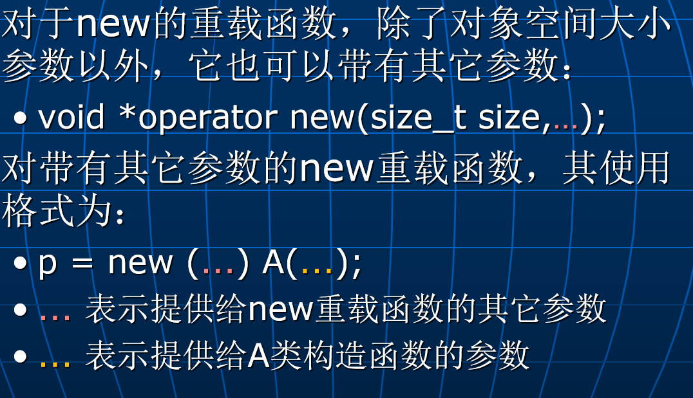
例如，下面重载的new在非“堆区”为动态对象分配空间：

```cpp
#include <cstring>
class A
{		int x,y;
	public:
		A(int i, int j) { x=i; y=j; }
		void *operator new(size_t size, void *p)
		{ return p; //p是空间上为动态对象的分配空间地址
		}
};


char buf[sizeof(A)];
A *p=new (buf) A(1,2); //把buf传给new重载函数的参数p
                        //在buf中创建动态对象

p->~A(); //通过显式调用析构函数让p指向的对象消亡。
		      //不能用系统的delete，可以用自己重载的delete
```

#### delete的重载

一般来说，如果对某个类重载了操作符new，则相应地也要重载操作符delete。
操作符delete也必须作为静态的成员函数来重载（static可以不写），其格式为：
	void operator delete(void *p, size_t size);
返回类型必须为void。
第一个参数类型为void *，指向对象的内存空间。
第二个参数可有可无，如果有，则必须是size_t类型。

## 15.继承－－派生类

### 代码复用

**代码复用**是指：在开发一个新软件时，把现有软件的一些代码拿过来用，其好处是：

- 提高开发效率
- 保证软件质量
  不幸的是，不加修改地直接复用已有软件的代码往往比较困难，如何解决已有软件与新软件之间的代码差别？
  传统的做法是修改（复制-粘贴）已有软件的源代码，该方式存在缺点：需读懂源代码、可靠性差、易出错，而且源代码有时难以获得

类的**继承机制**为解决代码复用提供了更好的途径：
对已有软件中不符合新软件要求的类，可以通过继承机制来实现修改。

### 继承

在定义一个新的类时，先把已有的一个或多个类的功能全部包含进来，然后再在新的类中给出**新功能的定义**或对已有类的某些功能进行**重新定义**（修改）。

### 基类与派生类

- 基类（**父类**）：已有的类
- 派生类（**子类**）：新定义的类

继承分为：单继承和多继承

- 单继承：一个类只有一个直接基类。
- 多继承：一个类有多个直接基类。

### 单继承

派生类只有一个直接基类。

```cpp
class <派生类名>:[<继承方式>] <基类名>
{	<成员说明表>
}; 
```

<继承方式>可以不加，默认为**private**。

```cpp
class A //基类
{		int x,y;
	public:
		void f();
		void g();
};
class B: public A //派生类
{		int z; //新成员
	public:
		void h(); //新成员
		void g(); //对A的成员函数g重定义？
			     //后面会详细介绍如何重定义。
};
```

派生类除了拥有新定义的成员外，基类的所有成员（基类的构造函数、析构函数和赋值操作除外）都属于它。
实际上，派生类的对象包含了基类的一个**子对象**。
定义派生类时一定要见到基类的定义。

```cpp
class A;  //声明，没有定义
class B: public A  //Error
{  int z;
  public:
   void h()
};
```

有关友元：
如果在派生类中没有显式指出，则基类的友元不是派生类的友元；
如果基类是另一个类的友元，而该类没有显式指出，则派生类不是该类的友元。

### 继承和封装的矛盾

派生类不能直接访问基类的私有成员。
但是在创造函数的时候，往往需要访问基类的私有成员，带来了继承和封装的矛盾。

### protected 访问控制

用 `protected` 说明的成员不能通过对象使用，但可以在派生类中使用。
缓解了继承和封装的矛盾。

C++类向外界提供两种接口：

- public：供类的实例用户使用（通过对象）
- protected：供派生类使用

一般情况下，应该把今后不太可能发生变化的、有可能被派生类使用的、不宜对实例用户公开的成员声明为protected。

### 派生类成员标识符的作用域

对基类而言，派生类成员标识符的作用域是**嵌套**在基类作用域中的。
如果派生类中定义了与基类**同名**的成员，则基类的成员名在派生类的作用域内**不直接可见**（被**隐藏**，Hidden），在派生类中访问基类同名的成员时要用基类名受限。

```cpp
class A //基类
{		int x,y;
	public:
		void f();
		void g();
};
class B: public A
{		int z;
  public:
		void f(); //隐藏了A的f！
		void h()
		{	f();  //B类中的f
			A::f();  //A类中的f，要受限地访问
		}
};
```

即使参数不同，只要函数名相同，就构成了**隐藏**。
不属于函数名重载，因为作用域不同。

也可以在派生类中使用using声明把基类中某个的函数名对派生类开放。

```cpp
class A //基类
{		int x,y;
	public:
		void f();
		void g();
};

class B: public A
{		int z;
	public:
		using A::f;
		void f(int); //带参数的f
		void h() 
		{	f(1);  //OK
			f();  //OK，等价于A::f();
		}
};
```

### 在派生类的**外部**访问基类成员

派生类的**用户**能访问从基类继承来的哪些成员？

```cpp
class A// 基类
{	public:
		void f();
	protected:
		void g();
	private:
		void h();
};
class B: ... A// 派生类
{      ......
};
//B的用户1，实例用户
void func()
{ B b;
   b.f(); //?
   b.g(); //?
   b.h(); //?
}
//B的用户2，派生类用户
class C: public B
{	public:
		void r()
		{	f(); //?
			g(); //?
			h(); //?
     }
};
```

由继承方式和基类的访问控制权限共同决定。

### 继承方式

```cpp
class <派生类名>:[<继承方式>] <基类名>
{	<成员说明表>
}; 
```

继承方式可以是：

- public：公有继承
- protected：保护继承
- private：私有继承

用来规定派生类中**从基类继承来的成员**的访问权限。
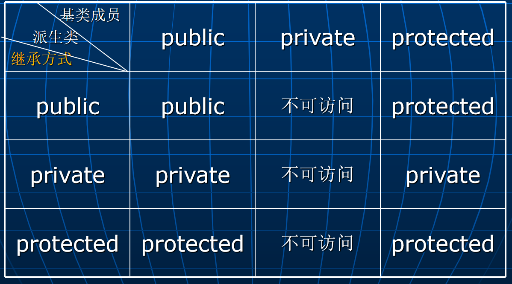
回到刚才的问题

```cpp
class A// 基类
{	public:
		void f();
	protected:
		void g();
	private:
		void h();
};
class B: protected A// 派生类，假设继承方式为protected
{       // f 是protected
        // g 是protected
        // h 不可访问
        public:
	    void q() //新成员 
	    {  f(); //OK
	       g(); //OK
	       h(); //无法访问
	    }// 新成员，与b的继承方式没有任何关系，因为不是从基类继承来的，这里能否访问看基类中是否是public或者protected的

};
//B的用户1，实例用户
void func()
{ B b;
   b.f(); //不可访问
   b.g(); //不可访问
   b.h(); //不可访问
   b.q(); //OK，因为B类中q是public的
}
//B的用户2，派生类用户
class C: public B
{	public:
		void r()
		{	f(); //OK，因为是protected继承
			g(); //OK，因为是protected继承
			h(); //不可访问
            q(); //OK，因为C类是B类的派生类，而B类中q是public的
     }
};
```

### 子类型

对用类型T表达的所有程序P，当用类型S去替换程序P中的所有的类型T时，程序P的**功能不变**，则称类型S是类型T的子类型。

在**public继承**中，派生类继承了基类的对外接口（基类的public成员函数），对基类对象所能实施的操作都可以作用于派生类对象。
因此，以public方式继承的派生类**可看作是基类的子类型**，即，在需要基类对象的地方可以用派生类对象去替代。

### 派生类对象的初始化和消亡处理

派生类对象的初始化由基类和派生类共同完成：

- 从基类**继承的**数据成员由基类的构造函数初始化
- 派生类**新的**数据成员由派生类的构造函数初始化

创建派生类的对象时，先调用派生类的构造函数，但是在进入函数体之前，会先调用基类的构造函数，初始化从基类继承来的数据成员。
类比类作为另一个类的成员对象的初始化。

当派生类对象消亡时，先调用本身类的析构函数，本身类析构函数的函数体执行完之后，再去调用基类的析构函数。

### 派生类拷贝构造函数

派生类自定义的拷贝构造函数：

- 在默认情况下调用基类的默认构造函数对基类成员初始化。
- 需要在“成员初始化表”中显式地指出调用基类的拷贝构造函数来实现对基类成员的初始化。

### 派生类对象的赋值操作

派生类自定义的赋值操作，不会自动调用基类的赋值操作，需要在自定义的**赋值操作符重载函数**中显式地指出调用基类的赋值操作。

## 16.虚函数与消息的动态绑定

### 消息的多态性

不同类型的对象可以处理相同的消息，但处理方式往往是不一样的，因此，同一条消息可以有不同的解释（处理）。

### 消息的静态绑定

一般情况下，在**编译时刻**根据对象的类型来决定采用哪一个消息处理函数，即采用**静态绑定**。

### 消息的动态绑定

在public继承中，由于基类的指针或引用可以指向或引用基类对象，也可以指向或引用派生类对象，这就存在一种特殊的多态性.
如果在基类和派生类中**都给出了对某条消息的处理函数**，那么，通过基类的指针或引用向它指向或引用的对象发送这条消息时，它会调用哪一个消息处理函数?

```cpp
class A
{	 int x,y;
  public:
	 void f();
};
class B: public A
{	 int z;
  public:
   	void f(); 
   	void g();
};

void func1(A& x)
{	......
	x.f(); //调用A::f还是B::f ?
    // A::f
	......
}
void func2(A *p)
{	......
	p->f(); //调用A::f还是B::f ?
    // A::f
	......
}
......
A a;
func1(a);
func2(&a);
B b;
func1(b);
func2(&b);
```

C++默认采用的是静态绑定！与声明函数时的参数类型一致，与传入的对象类型无关。
需要动态绑定，来使得通过传入的对象类型确定调用哪一个消息处理函数。

```cpp
class A
{		int x,y;
	public:
		virtual void f(); //虚函数
};
class B: public A
{		int z;
	public:
   		void f(); 
   		void g();
};
```

在基类中声明一个函数为虚函数，其他不变，这样就会动态绑定。

```cpp
A a;
func1(a); //在func1中调用A::f，因为传入的是A类型的对象
func2(&a); //在func2中调用A::f
B b;
func1(b); //在func1中调用B::f，因为传入的是B类型的对象
func2(&b); //在func2中调用B::f
```

### 虚函数

虚函数是指加了关键词virtual的成员函数。其格式为：
`virtual <成员函数声明>;`
虚函数有两个作用：

- 指定消息采用动态绑定。
- 指出基类中**可以被派生类重定义**的成员函数。

对于基类中的一个虚函数，**在派生类中定义的**、**与之具有相同型构**的成员函数是对基类该成员函数的重定义（或称**覆盖**，override）。
相同型构是指派生类中定义的成员函数：

- 名字、参数个数和类型与基类相应成员函数相同；
- 返回值类型与基类成员函数返回值类型**可以相同**，也可以是基类成员函数返回值类型的**public派生类**。

消息的动态绑定将绑定到派生类中**与基类同型构**的成员函数

```cpp
class A
{	 int x,y;
  public:
	 virtual void f(int);
};
class B: public A
{	 int z;
  public:
   	void f(int);  //对A中f的重定义
 	void f(double); //新定义的成员函数
   	void g();
};
......
A *p=new B;
p->f(1); //调用B::f(int)
p->f(1.0); //double转换成int，调用B::f(int) 为什么给的参数是double，不调用B::f(double)？
// 因为p首先是一个基类A的指针，所以只能调用基类中的虚函数，动态绑定到B::f(int)
```

如果这里没加virtual，那么p->f(1.0)就会调用A::f(int)，因为p是一个A类型的指针，B里面的f和A里面的f就没有关系。
不是虚函数，就不允许重定义。

```cpp
class A
{	 int x,y;
  public:
	 virtual void f(int);
};
class B: public A
{	 int z;
  public:
 	void f(double) override;
	void g();
};
```

这里f本来是想对A中的f重定义，但是写错了参数类型，所以加上一个override关键字，编译器会检查基类里面是否有同型构的虚函数，没有就会报错。

如果在派生类中给出了“完美”的重定义，不需要在之后的派生类中再重定义，可以在重定义时加上**final**。

```cpp
class A
{	 int x,y;
  public:
	 virtual void f(int);
};
class B: public A
{	 int z;
  public:
 	void f(int) final; //不允许在之后的派生类中再重定义
	void g();
};
class C: public B
{	 ......
  public:
 	void f(int); //Error，不能再重定义！
};
```

final还有一个作用：指出不允许被继承的类。

```cpp
class A final //不允许继承
{	......
};
class B: public A //Error
{	......
};
```

只有通过基类的指针或引用访问基类的**虚函数**时**才进行动态绑定**。
只要在基类中说明了虚函数，在派生类、派生类的派生类、...中，与基类同型构的成员函数都是虚函数（virtual可以不写）。
基类的构造函数和析构函数中对虚函数的调用不进行动态绑定，因为可能会使用还未初始化的数据成员。

```cpp
class A
{  ......
  public:
	A() { f(); }
	~A() { f(); }
	virtual void f();
	void g();
	void h() { f(); g(); }
};
class B: public A
{  .......
 public:
   B();
	~B();
	void f(); 
	void g(); 
};

A a;  //调用A::A()和A::f
a.f();  //调用A::f
a.g();  //调用A::g
a.h();  //调用A::h、A::f和A::g
//a消亡时会调用A::~A()和A::f

B b;  //调用B::B()、A::A()和A::f
b.f();  //调用B::f
b.g();  //调用B::g
b.h();  //调用A::h、B::f和A::g
//b消亡时会调用B::~B()、A::~A()和A::f


A *p;   //p是A类（基类）指针
p = &a; //p指向A类对象
p->f();  //调用A::f
p->g();  //调用A::g
p->h();  //调用A::h, A::f和A::g

p = &b;  //p指向B类对象
p->f();  //调用B::f
p->A::f(); //调用A::f，类名受限采用静态绑定
p->g();  //调用A::g，非虚函数采用静态绑定
p->h();  //调用A::h, B::f和A::g
p = new B;  //调用B::B(), A::A()和A::f
.......
delete p;  //只调用A::~A()和A::f ，
               //没调用B:~B()，因为p是A类指针，只调用A的析构函数
                 //没有把A的析构函数定义为虚函数！加了virtual就可以调用B的析构函数
```

通过基类指针访问派生类中重定义的成员函数，用动态绑定就行了。
通过基类指针访问派生类中新定义的成员，怎么办？
可以使用**强制类型转换**将基类指针转换为派生类指针。

```cpp
B *q = (B *)p; //将p转换为B类指针
q->g(); //调用B::g
```

但是这样不安全！

```cpp
A *p;
......
B *q=dynamic_cast<B *>(p);
if (q != NULL) q->g();
```

如果p指向的不是B类对象，q为空

那些时候需要定义虚函数？

- 在设计基类时，有时虽然给出了某些成员函数的实现，但实现的方法可能不是最好，今后可能还会有**更好的**实现方法。
- 在基类中根本无法给出某些成员函数的实现，它们必须由不同的派生类根据实际情况给出具体的实现。（**抽象类与纯虚函数**）

## 17.纯虚函数与抽象类

### 纯虚函数

纯虚函数是**没给出实现的虚函数**，函数体用“=0”表示

```cpp
class A
{	......
	public:
		virtual int f()=0; //纯虚函数
	......
};
```

纯虚函数要在派生类中给出实现

### 抽象类

包含纯虚函数的类称为**抽象类**。

```cpp
class A //抽象类
{	  ......
	public:
		virtual int f()=0; //纯虚函数
	......
};
```

至少要包含一个纯虚函数
抽象类不能用于创建对象
抽象类的作用：

- 对不同类型的**公共特征**进行抽象描述。除了纯虚函数外，它可以包含普通虚函数和非虚函数。
- 为同一个类型的**不同实现**提供一个抽象描述（**接口**）。它只包含纯虚函数。

### 例：实现图形的基本框架

比如在上面那个图形的例子中：

```cpp
class Figure //抽象基类
{  int id;
public:
	Figure(int i) { id = i; }
	//派生类必须实现的功能
	virtual void draw() const=0; 
	virtual void input_data()=0; 
	//派生类可以自己实现的功能
	virtual double area() const { return 0;}
	//派生类不能自己实现的功能
	int get_id() { return id; }
	......
};
```

下面实现矩形类：

```cpp
class Rectangle: public Figure // 继承
{		double left,top,right,bottom;
	public:
		void draw() const
		{	...... //画矩形
		}
		void input_data()
		{	cout << "请输入矩形的左上角和右下角坐标 (x1,y1,x2,y2) ：";
			cin >> left >> top >> right >> bottom;
		}
		double area() const //派生类自己实现
	  { return (bottom-top)*(right-left); 
     }
     ......
};
```

圆形同理

```cpp
const double PI=3.1416;
class Circle: public Figure
{		double x,y,r;
	public:
		void draw() const
		{	...... //画圆
		}
		void input_data()
		{	cout << "请输入圆的圆心坐标和半径 (x,y,r) ：";
			cin >> x >> y >> r;
		}
		double area() const //派生类自己实现
     { return r*r*PI; }
     ......
};
```

还有线段

```cpp
class Line: public Figure
{		double x1,y1,x2,y2;
	public:
		void draw() const
		{	...... //画线
		}
		void input_data()
		{	cout << "请输入线段的起点和终点坐标 (x1,y1,x2,y2) ：";
			cin >> x1 >> y1 >> x2 >> y2;
		}
	  //派生类没有自己实现area，用基类的，因为线段不存在面积这一说
     ......
};
```

一批图形的输入：

```cpp
const int MAX_NUM_OF_FIGURES=100;
Figure *figures[MAX_NUM_OF_FIGURES];
int count=0;

for (count=0; count<MAX_NUM_OF_FIGURES;	count++)
{	int shape;
	do
	{	cout << "请输入图形的种类(0：线段，1：矩形，2：圆，-1：结束)：";
		cin >> shape;
	} while (shape < -1 || shape > 2);
	if (shape == -1) break;
	switch (shape)
	{	case 0: //线
			figures[count] = new Line(count);	break;
		case 1: //矩形
			figures[count] = new Rectangle(count); break;
		case 2: //圆
			figures[count] = new Circle(count); break;
 	}
	figures[count]->input_data(); //动态绑定到相应类的input_data并且调用
}

for (int i=0; i<count; i++)
		figures[i]->draw();  //通过动态绑定
						//调用相应类的draw
//输出图形
```

即使今后增加了图形的种类，上述代码（属于高层代码）也不需要改动，只要增加相应的类（属于低层代码）就行。
这就是多态的好处，便于高层代码复用。

### 用抽象类实现类的真正抽象作用

由于在C++中使用某个类时必须要见到该类的定义，因此，使用者能够见到该类的一些实现细节（如：非public成员），这样会使得类的抽象和封装作用大打折扣。
比如：

```cpp
//A.h （类A的定义，公开的）
class A
{	int i,j;
  public:
	A();
	A(int x,int y);
	void f(int x);
    ......
};
//A.cpp （类A的实现，不公开）
#include "A.h"
void A::A() { ...... }
void A::A(int x,int y) { ...... }
void A::f(int x) { ...... }

//B.cpp （类A的某个使用者）
#include "A.h"
void func(A *p)
{	p->f(2); //Ok
	p->i = 1; //Error
	p->j = 2; //Error
    //可绕过对象类的访问控制！看到了是i和j是int型变量
	*((int *)p) = 1; //Ok，访问p所指向的对象的成员i
	*((int *)p+1) = 2; //Ok，访问p所指向的对象的成员j
}
```

如何防止这种情况？
用抽象类，给类A提供一个抽象基类作为对外接口

```cpp
//I_A.h （类A的对外接口，公开）
class I_A
{ public:
   	  virtual void f(int)=0;
      ......
};
//A.h （类A的定义，部分公开）
#include "I_A.h"
class A: public I_A
{   int i,j;
   public:
A();
A(int x,int y);
void f(int x);
......
};
//A.cpp （类A的实现，不公开）
#include "A.h"
void A::A() { ...... }
void A::A(int x,int y) { ...... }
void A::f(int x) { ...... }
......
//B.cpp （类A的某个使用者）
#include "I_A.h"
void func(I_A *p)
{	p->f(2);  //Ok

	*((int *)p) = 1;  //这里不知道p所指向的对象有哪些数据成员，
		   //因此，该操作不知道它访问的是什么数据成员
}
```

## 18.多继承

### 必要性

对于下面的两个类A和B：

```cpp
class A
{		int m;
	public:
		void fa();
};
class B
{		int n;
	public:
		void fb();
};
```

如何定义一个类C，它包含**A和B的所有成员**，另外还拥有**新的数据成员**r和**成员函数**fc？

### 用单继承实现

```cpp
class C: public A //让C从A继承
{		int n,r; //把B类中的n复制过来
	public:
		void fb(); //把B类中的fb复制过来
		void fc();
};
//或者
class C: public B //让C从B继承
{		int m,r; //把A类中的m复制过来
	public:
		void fa(); //把A类中的fa复制过来
		void fc();
};
```

这样有什么缺点？

- 概念混乱：导致A和B之间增加了层次关系
- 易造成不一致：A中的m、fa与C中的m、fa可能会不一致。
- 不能完全实现子类型：只有A和B中某一类对象能被C类对象替代，另外一个不行

### 用成员对象实现

```cpp
class C
{		A a;
		B b;
		int r;
	public:
		void fa() { a.fa(); }  //重新实现fa
		void fb() { b.fb(); }  //重新实现fb
		void fc();
};
```

但是这样不能实现**子类型**：程序中需要A和B类对象的地方**都不能用C类对象去替代**。

### 用**多继承**实现

```cpp
class C: public A, public B
{		int r;
	public:
		void fc();
};
```

多继承是指派生类可以有**一个以上的直接基类**。
继承方式及访问控制的规定同单继承，派生类拥有**所有基类的所有成员**。
基类的声明次序决定派生类对象对基类数据成员的**存储安排**和对基类构造函数/析构函数的**调用次序**。

这个图里内存存储的顺序就是按照基类声明的顺序

public多继承的派生类与它的各个基类之间是子类型关系，各个**基类**的指针或引用可以指向或引用**派生类对象**

分别指向c里面A的部分和B的部分，因为指针类型不一样

### 多继承带来的问题

单继承带来的是树形结构，而多继承会导致变成图结构，非常复杂
语言特征复杂化，编译程序的难度加大，消息绑定复杂化

两个基本问题：

- 名冲突问题
- 重复继承问题

#### 名冲突问题


C++解决名冲突的办法是：**基类名受限**

```cpp
class C: public A, public B
{		......
	public:
		void func()
		{	A::f(); //OK，调用A的f。
			B::f(); //OK，调用B的f。
		}
};
......
C c;
c.A::f(); //OK，调用A的f。
c.B::f(); //OK，调用B的f。
```

#### 重复继承问题

下面的类D从类A继承两次，称为重复继承：
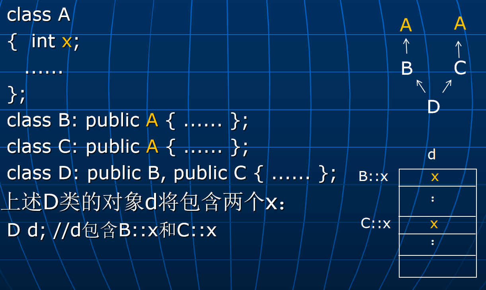
如果要让类D里面只有一个x，则应把A定义为B和C的虚基类

```cpp
class A { int x; ......};
class B: virtual public A {......};
class C: virtual public A {......};
class D: public B, public C {......};
```

在多继承中，如果有**公共的虚基类**（直接或间接），那么，这些虚基类的数据成员在派生类中将会**被合并**！
这样，上述D类的对象d就只有一个x了

## 19.聚合与组合

### 继承不是类代码复用的唯一方式

有些代码复用不宜用继承来实现,继承除了支持代码复用外，还体现了类之间在概念上的**一般与特殊关系**（is-a-kind-of）
并且，继承与封装存在矛盾，而且继承加大了类之间的耦合度，不利于程序的维护

类之间除了继承关系外，还存在一种**整体与部分的关系**（is-a-part-of），即一个类的对象包含了另一个类的对象。
类之间的整体与部分的关系可以分为**聚合**和**组合**

### 聚合

在聚合关系中，被包含的对象与包含它的对象**独立**创建和消亡，被包含的对象可以脱离包含它的对象**独立存在**。
聚合类的成员对象一般是采用**对象指针**表示，用于指向被包含的成员对象。
被包含的成员对象是**在外部创建**，然后加入到聚合类对象中。

```cpp
class A { ...... };
class B //B与A是聚合关系
{ A *pm; //指向成员对象
public:
   B(A *p) { pm = p; } //成员对象在聚合类对象外部创建，然后传入
   ~B() { pm = NULL; } //传进来的成员对象不再是聚合类对象的成员
   ......
};
......
A *pa=new A; //创建一个A类对象
B *pb=new B(pa); //创建一个聚合类对象，其成员对象是pa指向的对象
......
delete pb; //聚合类对象消亡了，其成员对象并没有消亡
...... // pa指向的对象还可以用在其它地方
delete pa; //聚合类对象原来的成员对象消亡
```

### 例：公司由一批员工组成

```cpp
class Employee //职员类
{ string name; 
   int salary;
 public:
   Employee(const char *s, int n=0):name(s) 
   {	salary = n; }
   void set_salary(int n) { salary = n; }
   int get_salary() const { return salary; }
   ......
};

const int MAX_NUM_OF_EMPS=1000;
class Company //公司类
{ String name; 
   Employee *group[MAX_NUM_OF_EMPS]; //职员数组
   int num_of_emps; //职员人数
 public:
   Company(const char *s):name(s) 
   { num_of_emps = 0; }
   ~Company() { num_of_emps = 0; }
   bool add_employee(Employee *e);
   bool remove_employee(Employee *e);
   int get_num_of_emps() { return num_of_emps; }
   ......
};
//创建两个公司类对象
Company c1("Company_1"),c2("Company_2");
//创建两个职员对象
Employee e1("Jack",1000),e2("Jane",2000);

//职员Jack加入公司Company_1
c1.add_employee(&e1); 
//职员Jane加入公司Company_1
c1.add_employee(&e2); 

//职员Jack从公司Company_1离职
c1.remove_employee(&e1);

//职员Jack加入公司Company_2
c2.add_employee(&e1); 
......
```

### 组合

在组合关系中，被包含的对象**随包含它的对象创建和消亡**，被包含的对象不能脱离包含它的对象独立存在。
组合类的成员对象一般**直接是对象**，有时也可以采用**对象指针**表示。但不管是什么表示形式，成员对象一定是在组合类对象**内部创建**并随着组合类对象的消亡而消亡。

可以通过成员对象实现组合

```cpp
class A
{ ......
};
class C //C与A是组合关系
{ A a; //成员对象
public:
  ......
};
......
C *pc=new C; //创建一个组合类对象，其成员对象在组合类对象内部创建
.....
delete pc; //组合类对象与其成员对象都消亡了
```

### 继承与聚合/组合的比较

继承的代码复用功能常常可以用组合来实现
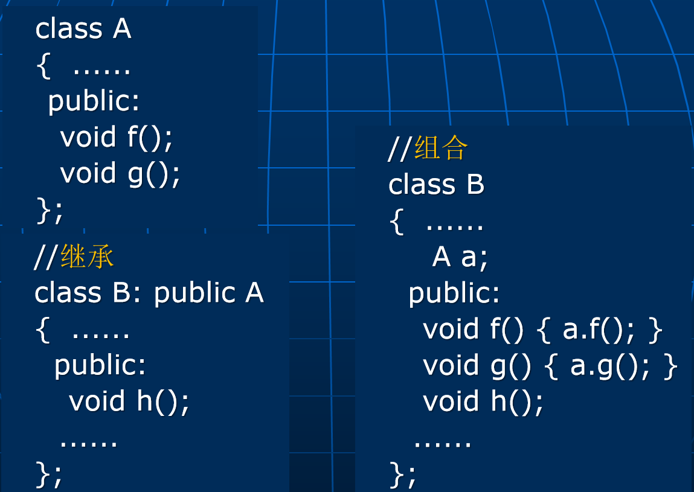
继承更容易实现子类型，具有聚合/组合关系的两个类不具有子类型关系。

## 20.输入与输出

### 概述

输入输出简称I/O，是程序的重要组成部分
由具体的**标准库**的功能来提供
输入/输出操作往往是带**内存缓冲区**的，解决内存与外设存取速度不匹配问题，提高效率：

- 输出时，输出的数据先放内存缓冲区中，缓冲区**满了之后再实际输出到外设**。
- 输入时，先从外设输入一大块内容**放入内存缓冲区**，然后从缓冲区中**逐步输入**数据。

### printf、scanf的缺陷

过程式，从C语言的函数库保留而来的
printf和scanf是两个带可变参数的函数，它们的第一个参数为一个格式串，指出后面要输入/输出的**数据的类型和个数**。
类型不安全，可能导致类型或者个数不一致，造成运行错误

### cin、cout的优势

面向对象的输入输出，用相应的输入输出类和重载过后的 `<<`和 `>>`实现
不需要专门指定数据的类型和个数，**编译时刻**根据数据本身来决定数据的类型和个数，可以避免与类型和个数相关的错误

### I/O的分类

- 面向控制台的I/O，从标准输入设备（键盘）获得数据，运行结果从标准输出设备（显示器）输出
- 面向文件的I/O，从外存（磁盘）获得数据，运行结果保存在外存中
- 面向字符串变量的I/O，从程序中的字符串变量获得数据，把运行结果保存到字符串变量中

### C++的I/O类库中基本的类

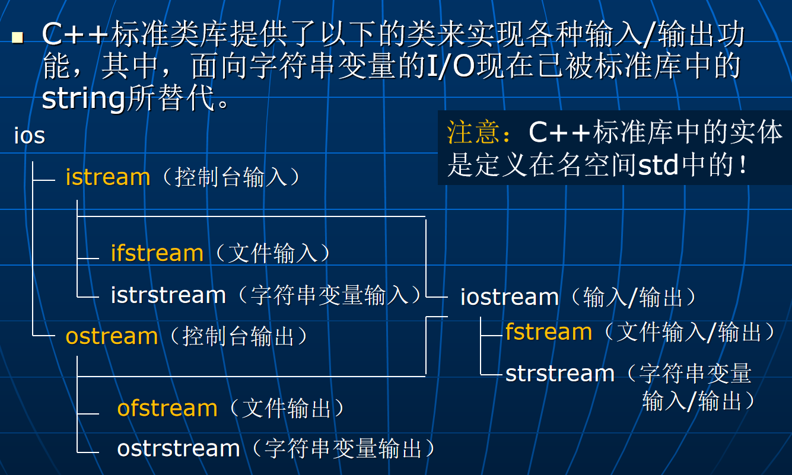
istream只能输入，ostream只能输出
想要既能输入又能输出，就需要iostream这个类，是从istream和ostream**多继承**而来的

#### 基于I/O类库进行I/O的**基本步骤**

首先要创建某个I/O类的一个**对象**，然后，调用该对象类的**成员函数**进行基于**字节流**的输入/输出操作。

比如控制台输入：

```cpp
istream in(...); //创建istream类的一个对象in
in.get(ch); //读入一个字节，ch为一个字符变量
in.read(p,100); //每次读入100个字节，放入p中，p是内存空间首地址
```

控制台输出：

```cpp
ostream out(...); //创建ostream类的一个对象out
out.put(ch); //输出一个字节，ch为一个字符变量
out.write(p,100); //把p指向的内存中100个字节输出
```

标准库中的I/O类还针对输入/输出类分别重载了操作符 `>>`（抽取）和 `<<`（插入），用它们可以进行C++基本类型数据的输入/输出操作。

```cpp
//控制台输入
istream in(...);
in >> x; //x是一个基本数据类型的变量
in >> y; //y是一个基本数据类型的变量
//控制台输出
ostream out(...);
out << e1; //e1是一个表达式
out << e2; //e2是一个表达式
```

用操作符 `>>`进行输入时，它把输入的内容看成是一个**字符串**，会自动进行从字符串到基本数据类型的**转换**。
用操作符 `<<`进行输出时，它会把基本数据类型的数据**转换成字符串输出**。

### 面向控制台的I/O

在I/O类库中**预定义**了四个I/O对象，可以直接用来进行**控制台的输入/输出操作**

- cin：istream类的对象，对应**标准输入设备**
- cout：ostream类的对象，对应**标准输出设备**
- cerr和clog：ostream类的对象，对应着计算机系统用于输出**特殊信息**（如程序错误信息）的设备。（通常也对应着显示器，但不受**输出重定向**的影响）。cerr为不带缓冲的，clog为带缓冲的。

在进行控制台输入/输出时，程序中需要有 `#include <iostream>` 这个命令

输入/输出重定向：`C>program.exe <a.txt >b.txt`
程序中所有cin从文件a.txt中获得输入，<号代表输入的文件
程序中所有cout输出到文件b.txt中，>号代表输出的文件

#### 控制台的输出操作

用插入操作符 `<<`进行基本数据类型数据的输出
特殊情况：输出**指向字符的指针**时，并不是输出指针的值（地址），而是输出它指向的字符串。
如果要输出字符指针的值，需要把它转换成其它类型的指针，比如转换成void *类型

##### 输出格式控制

可以通过输出一些**操纵符**（manipulator）来实现

```cpp
#include <iostream>
#include <iomanip>  //操纵符声明的头文件。
using namespace std;
.....
int x=10;
cout << hex << x << endl; //以十六进制输出x的值，然后换行。
```

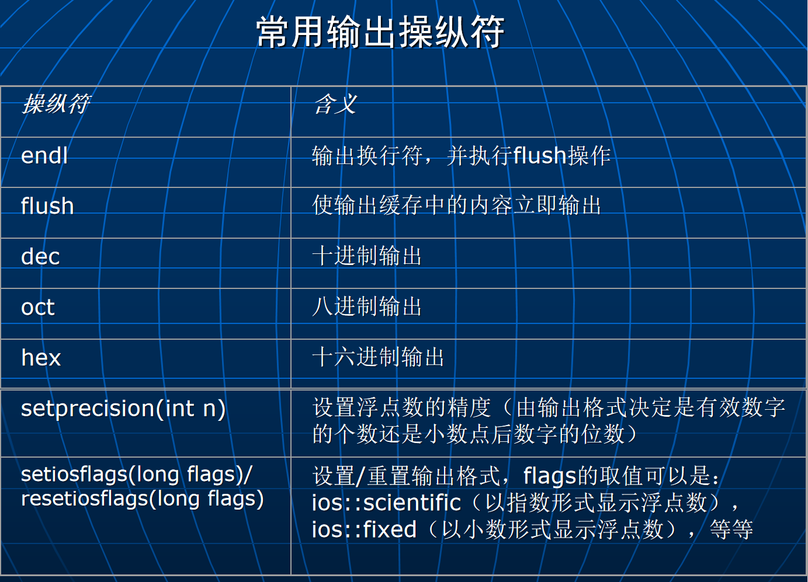
对于浮点数（float、double和long double）：

- 当输出格式为 `ios::scientific`或 `ios::fixed`时，操纵符setprecision用于设置浮点数**小数点后面的位数**
- 当输出格式为自动方式（既不是ios::scientific也不是ios::fixed，或两者同时设了）时，操纵符setprecision用于设置浮点数**有效数字的个数**，这时的输出格式根据有效数字自动确定。

除了用操作符 `<<`进行基本数据类型的输出外，也可以用ostream类的成员函数进行**基于字节**的控制台输出操作。

```cpp
//输出一个字节。
ostream& ostream::put(char ch); 
cout.put('A');
//输出p所指向的内存空间中count个字节。
ostream& ostream::write(const char *p,int count);
char info[100];  
int n;
......
cout.write(info,n); 
```

#### 控制台的输入操作

用抽取操作符 `>>`进行基本数据类型数据的控制台输入。

用抽取操作符>>进行输入时，各个数据之间一般要用**空白符**（空格、\t、\n）分开：
输入一个数据前，先**跳过空白符**
输入一个数据的过程中，碰到空白符或当前数据类型**不允许的字符**时，**结束**当前数据的输入

可以通过一些**操纵符**来控制输入的行为

```cpp
char str[10];
cin >> setw(10) >> str; //把输入的字符串和一个'\0'放入str中，也就是最多输入9个字符
// 多的字符放在输入缓冲区之中。
// 如果不加这个函数，可能会让str这个空间出问题，被撑爆
```

除了用操作符 `>>`进行基本数据类型的输入外，也可以用istream类的成员函数进行**基于字节**的控制台输入操作。

```cpp
//输入一个字节到ch中。
istream& istream::get(char &ch); 
//输入count个字节至p所指向的内存空间中。
istream& istream::read(char *p,int count);
//输入一个字符串放入p指向的内存空间中。输入过程直到输入了count-1个字符或遇到delim指定的字符为止，并自动在最后加上一个'\0'字符。
istream& istream::get(char *p, int count, char delim='\n'); 
istream& istream::getline(char *p, int count, char delim='\n');
```

用istream类的成员函数进行输入时，**空白符**也会作为字符输入！
因此如果要输入一个带空格的字符串，就用get或者getline，不会因为空白符结束

另外，可以用下面的成员函数**跳过**输入缓存中的若干字符

```cpp
cin.ignore(n,'\n'); //跳过输入缓存中n个字符，或碰到回车
//例如：
char str[5]; int x;
cin.get(str,5); //输入：abcdefg↙，只读入abcd，efg留在输入缓冲区中
cin.ignore(20,'\n'); //跳过输入缓冲区中遗留的efg
cin >> x; //输入：12↙，x得到12，它输入缓冲区中遗留的efg已经被跳过
```

#### 操作符 `>>`和 `<<`的重载

重载之后的这两个操作符只能进行基本数据类型的输入输出
自定义类型的对象，可以再对这两个操作符进行自定义的重载，就可以进行自定义对象的输入输出

例子：实现复数类的输出

```cpp
class Complex
{  ......
    friend ostream& operator << (ostream &out, const Complex &c);
  private：
	double real;
	double imag;		
};
ostream& operator << (ostream &out, const Complex &c)
{	out << c.real << '+' << c.imag << 'i';
	return out;
}
.....
Complex c1,c2;
cout << c1 << endl << c2 << endl;
```

### 面向文件的I/O

用于永久性保存数据的设备称为**外部存储器**（简称：外存），比如磁盘、光盘等

#### 文件

文件是外存（如磁盘）中组织数据的**基本单位**
每个文件都有一个名字（文件名），它由两部分构成：<主文件名>.<扩展名>
操作系统一般采用**树型**的目录结构来管理外存中的文件。一个文件在外存中的存储位置通常由一个**路径**来指出，路径上的每个结点是一个**文件夹**。

#### 文件数据的存储方式

对于一个整数：-1234567，有两种存储方式：

- 文本方式：按字符串把字符：-、1、2、3、4、5、6、7的ASCII码依次写入文件。（共8个字节）
- 二进制方式：按int型机内表示（补码：0xFFED2979），把它分成字节依次写入文件。（共4个字节）
- 文本方式
  由可显示的字符和有限的几个控制字符的编码字节构成，一般用于存储具有“行”结构在文字数据，用记事本等软件可以查看
- 二进制方式
  由任意没有显式含义的纯二进制字节构成，用于储存任意结构的数据，数据由对应的应用程序来解释

#### 文件的读写过程

- 打开文件：把程序内部的一个表示文件的变量或者对象与外部的具体文件关联起来，创建内存缓冲区
- 文件读写：存取文件中的内容
- 关闭文件：把暂存在内存缓冲区中的内容写入文件，并且归还打开文件的时候申请的内存资源（包括内存缓冲区）

#### 文件的位置指针

c++中把文件看成一系列字节构成的**字节串**，对文件中的数据的操作，通常是**逐个字节**顺序进行，因此称为**流式文件**
读入/写回第n个字节，首先要读入/写回前n-1个字节
每个打开的文件有一个内部隐藏的**位置指针**，指出文件的当前读写位置，每读写一个字节，位置指针会自动往后移动一个字节。

#### 文件的输出操作

在利用I/O类库中的类进行**文件**的输入/输出时，程序中需要包含下面的头文件：

```cpp
#include <iostream>  
#include <fstream>
```

**打开文件**：创建 `ofstream`类的一个对象，并建立它与外部某个文件之间的联系。

- 直接方式：创建对象的同时就建立与外部文件的联系

```cpp
ofstream out_file(<文件名> [,<打开方式>]); // 创建ofstream的对象out_file
// 例如，下面创建的对象out_file对应文件myfile.txt：
ofstream out_file("d:\\myfile.txt",ios::out);
```

- 间接方式：先用默认构造创建一个对象，然后用open建立与外部文件的联系

```cpp
ofstream::open(<文件名> [,<打开方式>]);
// 例如，让对象out_file对应文件myfile.txt：
ofstream out_file; //用默认构造函数创建对象out_file
out_file.open("d:\\myfile.txt",ios::out);
```

##### 打开方式

- ios::out
  打开一个外部文件用于写操作，如果外部文件已存在，则首先把它的**已有内容清除**；否则，先创建该外部文件（内容为空）。
  ios::out是**默认打开方式**。
- ios::app（不是application，是append）
  打开一个外部文件用于**添加操作**。（**不清除文件已有内容**，文件位置指针在末尾），如果外部文件不存在，则先创建该外部文件（内容为空）。
- ios::out | ios::binary 或 ios::app | ios::binary
  按**二进制方式**打开文件。（默认的是文本方式）
  对以文本方式打开的文件，当输出的字符为'\n'时，在某些平台上（如：Windows平台）将会自动把它转换成'\r'和'\n'两个字符写入外部文件。
  对以二进制方式打开的文件，**对输出的字节不做任何转换，原样输出**。

##### 判断打开操作是否成功

一共有三种方式

```cpp
if (!out_file.is_open())  //或：out_file.fail() 
				            //或：!out_file，因为!操作符已经在这个类中重载过了
{ ...... //失败处理
} 
```

#### 输出数据

文件成功打开后，可以使用插入操作符“<<”或ofstream类的一些成员函数来进行文件数据的输出操作

```cpp
int x=12;
double y=12.3;
......
//按文本方式输出数据
ofstream out_file("d:\\myfile.txt",ios::out);
if (!out_file) exit(-1);
out_file << x << ' ' << y << endl; //写入文件：12 12.3

//按二进制方式输出数据
ofstream out_file("d:\\myfile.dat",ios::out|ios::binary);// 使用二进制方式打开
if (!out_file) exit(-1);
out_file.write((char *)&x,sizeof(x)); //输出：4个字节 取x的地址，转化为char型指针，然后按照字节数写入文件
// 写入的是32位补码形式，占4个字节
out_file.write((char *)&y,sizeof(y)); //输出：8个字节
```

文件输出操作结束时，要使用ofstream的成员函数 `close`关闭文件：

```cpp
out_file.close(); 
```

关闭文件的目的：把文件**内存缓冲区**的内容写到外设文件中，并且归还打开文件时申请的资源
程序正常结束时，系统也会自动关闭程序打开的文件。

既然会自动关闭，为什么还要显式关闭？如果程序没有正常结束那么就不会把缓冲区里面的数据写入文件

#### 文件的输入操作

打开文件：创建ifstream类的一个对象，并把它与外部文件建立联系。

```cpp
// 直接方式
ifstream in_file(<文件名> [,<打开方式>]);
// 间接方式
ifstream in_file; //用默认构造函数初始化
in_file.open(<文件名> [,<打开方式>]);
```

打开方式：

- ios::in
  打开一个外部文件用于读操作。（默认）
- ios::in | ios::binary
  按二进制方式打开文件。（默认为文本方式）

打开文件时要判断打开是否成功，判断方式与文件输出打开操作的判断一样。
从文件输入必须要知道文件中数据的**存储方式和格式**

读取数据过程中有时需要判断是否正确读入了数据（尤其是在文件末尾处）。
判断是否正确读入了数据，可以调用ios类的成员函数 `fail`来实现：
`bool ios::fail() const;`
该函数返回true表示文件操作失败；返回false表示操作成功。

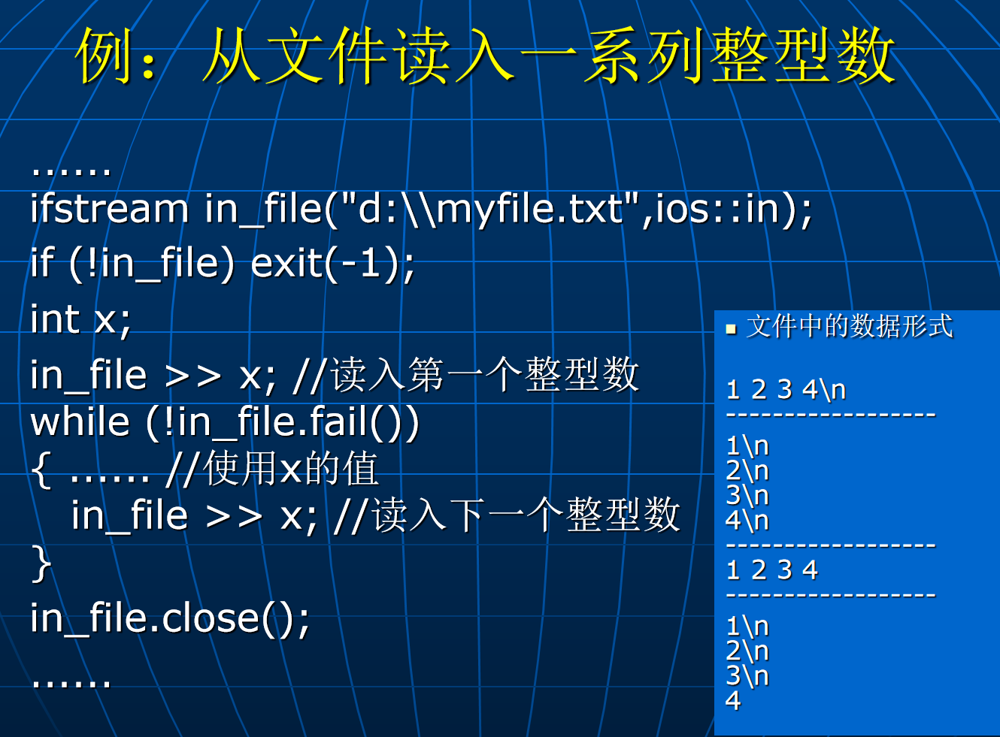
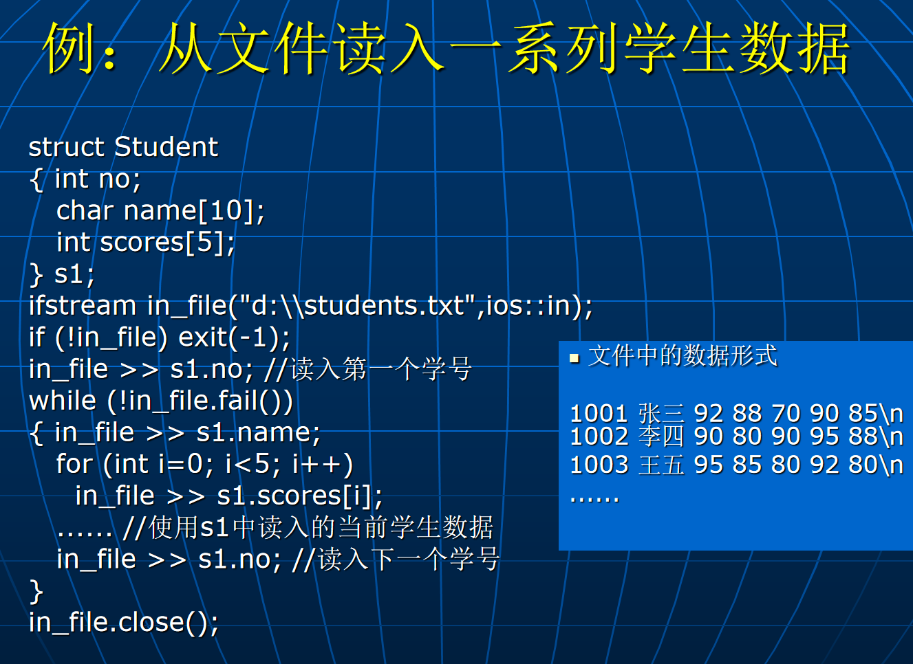

#### 有关文件读写的几点注意

以文本方式读写的文件要以文本方式打开；以二进制方式读写的文件要以二进制方式打开！
以文本方式输出的文件要以文本方式输入；以二进制方式输出的文件要以二进制方式输入！
不可混用

以二进制方式存取文件不利于程序的**兼容性和可移植性**

- 在不同**计算机平台**上，int型数据的各个字节在内存中的存储次序可能不一样（由低位到高位或由高位到低位）。
- 在不同的**编译环境**下，同样的一个结构类型数据所占的内存大小（字节数）可能不一样。

#### 能同时进行输入/输出的文件

如果需要打开一个**既能读入数据、也能输出数据**的文件，则需要创建一个fstream类的对象。
文件内部有**两个位置指针**，一个用于读，另一个用于写。
在创建fstream类的对象并建立与外部文件的联系时，文件打开方式应为下面之一：
ios::in|ios::out（可在文件任意位置写）
ios::in|ios::app（只能在文件末尾写）

#### 文件的随机存取

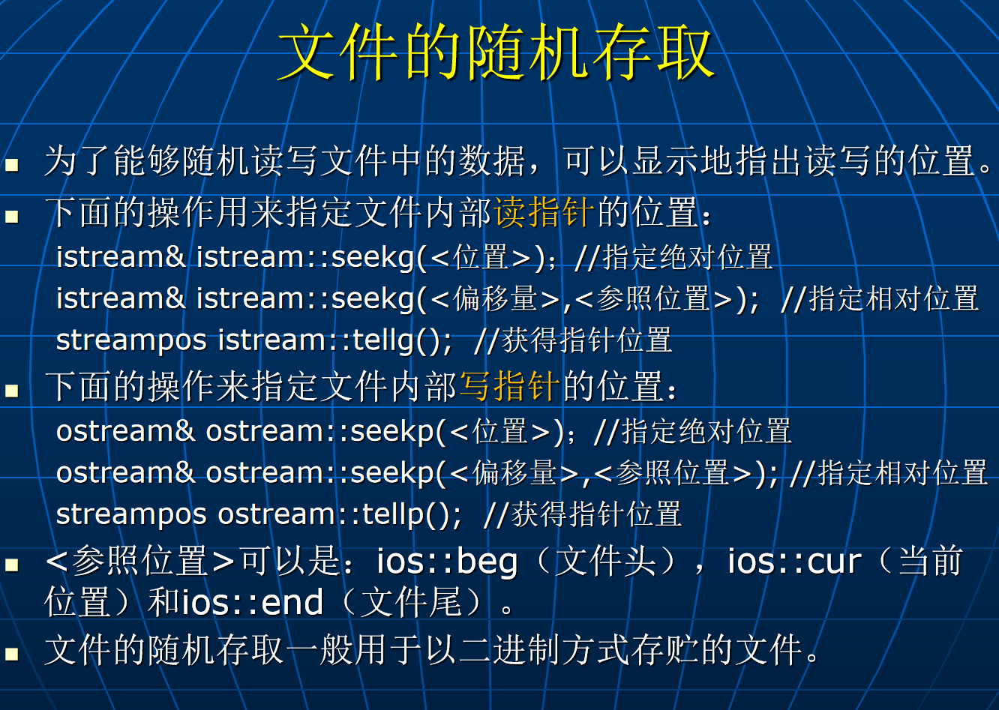

## 21.异常处理

错误通常包括语法错误和逻辑错误
运行异常（Exception）指程序设计对程序运行环境考虑不周而造成的程序运行错误。
在程序运行环境正常的情况下，运行异常的错误是不会出现的。
导致程序运行异常的情况是可以预料的，但它是无法避免的。
为了保证程序的**鲁棒性**（Robustness），必须在程序中对可能出现的异常错误进行**预见性处理**。

对于这些异常，就需要异常处理，包括：

- 发现异常，对可能出现的异常情况进行检测
- 处理异常，对检测到的异常进行处理。包括 就地处理：在发现异常的地方处理异常 和异地处理：在其它地方（非异常发现地）处理异常

### 就地处理

调用C++标准库中的函数exit或abort终止程序执行

- abort立即终止程序的执行，不作任何的善后处理工作。
- exit在终止程序的运行前，会做关闭被程序打开的文件、调用全局对象和static存储类的局部对象的析构函数（注意：不要在这些对象类的析构函数中调用exit）等工作。

```cpp
void f(char *filename)
{	ifstream file(filename);
	if (file.fail()) //发现异常
  { cerr << "文件打开失败\n";
	  exit(-1);	//处理异常
  }
  int x;
  cin >> x;
  ......
}
```

### 异地处理

一种解决途径：
通过函数的返回值，或指针/引用类型的参数，或全局变量把该函数执行中碰到的异常情况通知函数的调用者。
函数的调用者根据函数**返回的异常情况来处理异常**。

```cpp
int f(char *filename)
{ ifstream file(filename);
   if (file.fail()) 
     return -1; //把错误情况告诉调用者
   int x;
   cin >> x;   
   ......
   return 0; //函数正常返回
}
int main()
{  char str[100];
    ......
    int rc=f(str);
    if (rc== -1) //调用者根据返回值确定是否有异常
    { ...... //处理异常
    }
	 else
	 { ...... //正常情况
	 }
    ......
}
```

该途径有不足：

- 通过函数的返回值返回异常情况会导致正常返回值和异常返回值交织在一起，**有时无法区分**。
- 通过指针/引用类型的参数返回异常情况，需要引入**额外的参数**，给函数的使用带来负担。
- 通过全局变量返回异常情况会导致使用者会忽略这个全局变量的问题。（不知道它的存在）
- 程序的**可读性差**！程序的正常处理代码与异常处理代码混杂在一起，不能显式地区分它们。

另一种解决异常的异地处理途径：通过语言提供的结构化异常处理机制进行处理

### C++结构化异常处理机制

把有可能出现异常的**一系列操作**（语句或函数调用）放在一个 `try`语句块中。
如果try语句块中的某个操作在执行中发现了异常，则通过执行一个 `throw`语句生成一个**异常对象**，接在throw之后的操作不再进行。
生成的异常对象由程序中能够处理这个异常的地方通过 `catch`语句块来**捕获并处理**。

```cpp
void f(char *filename)
{ ifstream file(filename);
   if (file.fail()) 
     throw filename; //生成异常对象
   int x;
   cin >> x;
   ......
   return;
} 
int main()
{  char str[100];
    ......
    try { f(str); } //启动异常处理机制
    catch (char *fn) //捕获异常对象
    { ...... //处理异常
    }
    ...... //正常情况
}
```

### try语句

启动（激活）异常处理机制

### throw语句

用于生成异常对象并抛出该对象

### catch语句

用于捕获并处理异常对象
catch语句块紧跟在try语句块之后，可以有多个catch语句块，分别用于捕获不同类型的异常对象。
一个try语句块的后面可以跟多个catch语句块，用于捕获并处理不同类型的异常对象，它们采用**精确匹配**与throw所产生的异常对象进行绑定。

### 异常处理的嵌套

在try语句块的语句序列执行过程中还可以包含try语句块。
当在内层的try语句的执行中产生了异常，则首先在内层try语句块之后的catch语句序列中查找与之匹配的处理；如果内层不存在能捕获相应异常的catch，则逐步向外层进行查找。
如果生成的异常对象在程序的函数调用链上没有给出捕获，则调用系统的terminate函数进行默认的异常处理：terminate函数将会去调用abort函数。

## 22.泛型程序设计

### 泛型的基本概念

在程序设计中，经常需要用到一些**功能和实现都完全相同**的程序实体，但它们所涉及的**数据类型不同**。

例如，下面是对不同元素类型的数组进行排序的函数：

```cpp
void int_sort(int x[],int num);
void double_sort(double x[],int num);
void A_sort(A x[],int num);
```

这三个函数采用了同一种排序算法，并且都是由小到大排序。
能不能只用一个函数？

再例如，下面是元素类型不同的栈类：

```cpp
class IntStack
{		int buf[100];
	public:
		void push(int);
		void pop(int&);
};

class DoubleStack
{	double buf[100];
   public:
	void push(double);
	void pop(double&);
};

class AStack
{	A buf[100];
   public:
	void push(A);
	void pop(A&);
};
```

这三个类都用数组来表示栈的元素，操作的实现也相同
能不能只写一个类？

### 泛型程序设计

一个程序实体能对**多种类型的数据**进行相同操作的特性称为**类属**（Generics）
基于具有类属特性的程序实体进行程序设计的技术称为：**泛型程序设计**(Generic Programming)
具有类属特性的**程序实体**通常有：

- 类属函数
- 类属类

### 类属函数

类属函数是指能对**多种类型的数据**进行**相同操作**的函数。
C++中提供两种实现类属函数的方式：

- 通用指针类型的参数（C语言继承而来）
- 函数模板

### 用**通用指针参数**实现类属的排序函数

```cpp
typedef unsigned char byte;

void sort(void *base, //需排序的数据（数组）内存首地址
        unsigned int num, //数据元素的个数
        unsigned int element_size, //一个数据元素所占内存大小（字节数）
        bool (*cmp)(const void *, const void *) ) //比较两个元素的函数，函数指针
{ //不论采用何种排序算法，一般都需要对数组进行以下操作：
     //取第i个元素（由数组内存首地址、元素的偏移量以及元素所占内存大小决定）
      (byte *)base+i*element_size
     //比较第i个和第j个元素的大小 （利用调用者提供的回调函数cmp来实现，该函数返回true表示是需要的顺序）
      if (!cmp((byte *)base+i*element_size,(byte *)base+j*element_size))
      { //交换第i个和第j个元素的位置
        byte *p1=(byte *)base+i*element_size,
	     *p2=(byte *)base+j*element_size;
         for (int k=0; k<element_size; k++) //把两个元素逐个字节进行交换
         { byte temp=p1[k]; p1[k] = p2[k]; p2[k] = temp; } 
      }
}
```

使用这个sort函数，以对int型数组进行排序为例：

```cpp
//先定义一个对int型数据进行比较的函数
bool int_cmp(const void *p1, const void *p2)
{ return *((int *)p1) < *((int *)p2); }

int a[100]; 
......
//用int型数组调用sort
sort(a,100,sizeof(int),int_cmp);
```

用通用指针实现类属函数面临的问题：

- 需要大量的指针操作，比较麻烦，容易出错！
- 编译程序无法进行参数类型检查。

### 用**函数模板**实现类属的排序函数

函数模板是指带有类型参数的函数定义，格式如下：

```cpp
template <class T1, class T2, ...> //class也可以写成typename
<返回值类型> <函数名>(<参数表>)
{	......
}
```

在函数定义的前面加上关键词template以及函数模板的参数T1、T2等（它们的取值是某个类型）。
函数的<返回值类型> 、<参数表>中的参数类型以及函数体中的局部变量的类型可以是：T1、T2等。

```cpp
template <class T> 
void sort(T elements[], unsigned int count)
{
	......
	//比较第i个和第j个元素的大小
	if (!(elements[i] < elements[j]))
   { //交换第i个和第j个元素
	   T temp=elements [i];
	   elements[i] = elements [j];
	   elements[j] = temp;
   }
    ......
}
```

如何使用？

```cpp
int a[100];
sort(a,100);  //对int类型数组进行排序

double b[200]; 
sort(b,200);  //对double类型数组进行排序

A c[300]; 
sort(c,300);  //对A类型数组进行排序
       //在类A中，需重载操作符：<
       //可能还需要自定义拷贝构造函数和重载操作符=
```

**函数模板的实例化**
函数模板定义了一系列重载的函数。
要使用函数模板所定义的函数，首先必须要对函数模板进行实例化，给模板参数提供一个**具体的类型**，从而生成具体的函数
函数模板的实例化通常是**隐式**的，由编译程序根据**函数调用的实参类型**自动地把函数模板实例化为具体的函数。
这种确定函数模板实例的过程叫做**模板实参推导**（template argument deduction）

```cpp
int a[100];
sort (a,100);  
//实例化：用int去替代模板参数T
void sort(int elements[], unsigned int count) { ...... }
```

如果我们想要自定义的排序顺序，该怎么办？

```cpp
template <class T1, class T2> 
void sort(T1 elements[], unsigned int count, T2 cmp)
{	......
	//调用cmp来比较第i个和第j个元素的大小
	if (!cmp(elements[i],elements[j]))
   { 交换元素次序 
   }
	......
}
int a[100];
//由小到大排序
sort(a,100,[](int &x1,int &x2) { return x1<x2;});
//由大到小排序
sort(a,100,[](int &x1,int &x2) { return x1>x2;});
//上述调用的实例化：用int去替代T1，用λ表达式所属类型去替代T2
```

有时，编译程序无法根据调用时的实参类型来确定所调用的模板实例函数。例如：

```cpp
template <class T> 
T max(T a, T b)
{ return a>b?a:b;
}
......
int x,y,z;
double l,m,n;
z = max(x,y); //实例化和调用：int max(int,int)
l = max(m,n); //实例化和调用：double max(double,double)
max(x,m) //这个如何实例化？
```

解决办法：

- 显式类型转换

```cpp
   max((double)x,m); //实例化：double max(double a,double b)
   // OR
   max(x,(int)m); //实例化：int max(int a,int b)
```

- 显式实例化，在尖括号中指定模板参数的类型

```cpp
	max<double>(x,m); //实例化：double max(double a,double b)
    // OR
	max<int>(x,m); //实例化：int max(int a,int b)
```

除了类型参数外，函数模板还可以带有非类型参数

```cpp
template <class T, int size> //size为一个int型的普通参数
void f(T a)
{	T temp[size];
	......  
}
```

这样的函数模板在使用时需要显式实例化。例如，

```cpp
f<int,10>(1);  //实例化成模板函数f(int a)，其中的size为10 
```

### 类模板

例如，用类模板实现类属的栈类：

```cpp
template <class T> 
class Stack
{		T buffer[100];
		int top;
public:
		Stack() { top = -1; }
		void push(const T &x);
		void pop(T &x);
};
template <class T> //注意！！！类外实现的成员函数需加上模板头
void Stack <T>::push(const T &x) { ...... }
template <class T> //注意！！！类外实现的成员函数需加上模板头
void Stack <T>::pop(T &x) { ...... }
```

**类模板的实例化**
类模板定义了若干个类，在使用这些类之前需要对类模板进行实例化
类模板的实例化需要在程序中**显式地指出**

```cpp
Stack<int> st1; //实例化int型栈类并创建一个相应类的对象
int x;
st1.push(10); st1.pop(x);
```

除了类型参数外，类模板也可以带**非类型参数**。 例如：

```cpp
template <class T, int size> 
class Stack
{		T buffer[size];
		int top;
	public:
		Stack() { top = -1; }
		void push(const T &x);
		void pop(T &x);
};
template <class T,int size> 
void Stack <T,size>::push(const T &x) { ...... }
template <class T, int size> 
void Stack <T,size>::pop(T &x) { ...... }
......
// 实例化：用int去替代T，用100去替代size
Stack<int,100> st1; //st1为元素个数最多为100的int型栈
// 实例化：用double去替代T，用200去替代size
Stack<double,200> st2; //st2为元素个数最多为200的double型栈
```

### 模板的复用

模板也属于一种多态，称为**参数化多态**：
一段带有类型参数的代码，给该参数提供不同的类型就能得到多个不同的代码，即，**一段代码有多种解释**。
模板的复用是通过对模板进行**实例化**（用一个具体的类型去替代模板的类型参数）来实现的。
由于模板的实例化是在编译时刻进行的，它一定要见到相应的源代码，因此，模板属于**源代码复用**。

下面情况，可能会出问题：

```cpp
// file1.h
template <class T> 
class S //类模板S的定义
{    T a;
  public:
      void f();
};
extern void func(); //全局函数的声明

// file1.cpp
#include "file1.h"
template <class T> 
void S<T>::f() //类模板S中f的实现
{ ......
}
void func()
{ S<float> x; //实例化“S<float>”并创建该类的一个对象x
   x.f(); //实例化“void S<float>::f()”并调用之
} 
// file2.cpp
#include "file1.h"
int main()
{ S<float> s1; //实例化“S<float>”并创建该类的一个对象s1
   s1.f(); //没有实例化“void S<float>::f()”，但调用之
   S<int> s2; //实例化“S<int>”并创建该类的一个对象s2 
   s2.f(); //没有实例化“void S<int>::f()”，但调用之
   func();
   return 0;
} 
```

两个模块都能通过编译，但在连接时出错，连接程序指出：

```
undefined reference to `void S<int>::f()'
```

在file2里面，只include了.h而没有.cpp，所以在他的成员函数f()调用时：

- “void S`<int>`::f()”不存在，没有具体实现！
- 虽然也没实例化“void S`<float>`::f()”，但在file1.cpp中有这个实例，file2中调用的是file1中的实例。

解决上述问题的通常做法是把模板的定义和实现**都放在头文件中**，把有关模板的源代码都包含在头文件中。
但是这样有新问题，就是重复实例的问题。

**重复实例的处理**
在由多模块构成的程序中，由于每个模块是单独编译的，因此，会导致一个模板的某个实例存在于多个模块的编译结果中：

- 相同的函数模板实例
- 相同的类模板成员函数实例
  相同代码的存在会造成目标代码庞大

由**开发环境**来解决：记住已编译过的模块信息，编译第二个模块的时候不生成重复实例。（代价大！）
由**链接程序**来解决：相同的实例只保留一个，其余的舍弃。

## 23.基于STL的编程

### 什么是STL

C++除了保留了C的标准库外，另外还提供了一个**基于模板实现的标准模板库**（Standard Template Library，简称STL）

- 实现了一些面向序列数据的表示及常用的操作。
- 支持了一种抽象的编程模式，该模式隐藏了一些低级的程序元素，如数组、链表、循环等。

STL包含以下几个组件：

- 容器（Containers）：用于存储序列化的数据元素
- 迭代器（Iterators）：属于一种**智能指针**，它们指向容器中的数据元素，用于对容器中的数据元素进行遍历和访问
- 算法（Algorithms）：用于对容器中的数据元素进行一些常用的操作
- ......

基于STL编程的例子：从键盘输入一批正整数，然后对它们求最大数、求和、排序、输出

```cpp
#include <iostream>
#include <vector>
#include <algorithm>
#include <numeric>
using namespace std;
int main()
{	vector<int> v; //创建容器对象v，元素类型为int
	int x;
	cin >> x;
	while (x > 0) //生成容器v中的元素
	{	v.push_back(x); //往容器v中增加一个元素
		cin >> x;
	}
//利用算法max_element计算并输出容器v中的最大元素
	cout << "Max = " << *max_element(v.begin(),v.end()) 
		 << endl;
   //利用算法accumulate计算并输出容器v中所有元素的和
	cout << "Sum = " << accumulate(v.begin(),v.end(),0) 
		 << endl;
	//利用算法sort对容器v中的元素进行排序
	sort(v.begin(),v.end()); 
	//利用算法for_each输出排序结果
	cout << "Sorted result is:\n";
	for_each(v.begin(),v.end(), [](int x) { cout << ' ' << x;});
	cout << '\n';
	return 0;
}
```

### 容器

容器是由**同类型元素构成的、长度可变的元素序列**。
容器是用类模板来实现的，模板的参数包含了容器中元素的类型。
STL中提供了很多种容器，适合于不同的应用场合。

#### 主要容器：

- vector<>
  用于需要**快速定位**（访问）任意位置上的元素以及主要在元素序列的尾部增加/删除元素的场合。
  在头文件vector中定义，用**动态数组**实现
- list<>
  用于经常在元素序列中**任意位置上**插入/删除元素的场合。
  在头文件list中定义，用**双向链表**实现
- deque<>
  用于需要在元素序列的**头部和尾部**增加/删除元素以及需要**快速定位**的场合。
  在头文件deque中定义，用**分段的连续空间结构**实现
- stack<>和queue<>
  用于需要按照**先进后出**（FIFO）或**先进先出**（FILO）的顺序访问元素的场合。
  在头文件stack和queue中定义，分别用**数组**和**链表**实现。
- priority_queue<>
  它与queue的操作类似，不同之处在于：
  每次增加/删除元素之后，它将对元素位置进行调整，使得头部元素总是最大的。也就是说，每次删除的总是最大（**优先级最高**）的元素。
  在头文件queue中定义，基于deque或vector来实现。
- map<>和multimap<>
  用于需要根据**关键字**来访问元素的场合。
  容器中每个元素由**关键字和值**构成（它们属于一个pair结构类型，该结构有两个成员：first和second，first对应关键字，second对应值），元素是根据其关键字**排序**的。
  对于map，不同元素的关键字不能相同；对于multimap，不同元素的关键字可以相同。
  在头文件map中定义，用**红黑树**实现
- set<>和multiset<>
  它们分别是map和multimap的特例，每个元素**只有关键字而没有值**，或者说，关键字与值合一了。
  在头文件set中定义。
- basic_string<>
  与vector类似，不同之处在于其元素为字符类型，并提供了一系列与字符串相关的操作。
  string和wstring分别是它的两个实例：
  basic_string`<char>`
  basic_string<wchar_t>
  在头文件string中定义。

#### 容器的基本操作

- 往容器中增加元素
- 从容器中删除元素
- 获取容器中指定位置的元素
- 在容器中查找元素

如果容器的元素类型是一个类，则针对该类可能需要：

- 自定义拷贝构造函数和赋值操作符重载函数
  容器内部进行的一些操作中可能会创建新的元素（对象的拷贝构造）或进行元素间的赋值（对象赋值）。
- 重载小于操作符（<）
  容器内部进行的一些操作中可能要对元素进行“小于”比较运算。

### 迭代器

迭代器（iterator）属于一种**智能指针**，它们指向容器中的元素，用于对容器中的元素进行访问和遍历。
在STL中，迭代器是作为类模板来实现的（在头文件iterator中定义），它们可分为以下几种类型：

- 输出迭代器（output iterator，OouIt）
  只能**修改**它所指向的容器元素,间接访问（*）,++（只能向后遍历）
- 输入迭代器（input iterator，InIt）
  只能**读取**它所指向的容器元素,间接访问（*）和元素成员间接访问（->）,++、==、!=。
- 前向迭代器（forward iterator，FwdIt）
  可以**读取/修改**它所指向的容器元素，元素间接访问（*）和元素成员间接访问（->），++、==、!=操作
- 双向迭代器（bidirectional iterator，BidIt）
  可以**读取/修改**它所指向的容器元素，元素间接访问（*）和元素成员间接访问（->），++、**--**、==、!=操作
- 随机访问迭代器（random access iterator，RanIt）
  可以读取/修改它所指向的容器元素，元素间接访问（*）、元素成员间接访问（->）和下标访问元素（[]），++、--、+、-、+=、-=、==、!=、<、>、<=、>=
  注意：指向数组元素的**普通指针**可以看成是随机访问迭代器

由于不同的容器采用了不同的内部实现，因此，**不同的容器的迭代器的类型会有所不同**

- 对于vector、deque以及basic_string容器类，与它们关联的迭代器类型为随机访问迭代器（RanIt）
- 对于list、map/multimap以及set/multiset容器类，与它们关联的迭代器类型为双向迭代器（BidIt）。
- 对于queue、stack和priority_queue容器类，不支持迭代器！

可通过容器类的成员函数 `begin`和 `end`等获得容器的首尾迭代器。

### 算法

在STL中，除了用容器类自身提供的成员函数来操作容器元素外，还提供了一系列通用的对容器中元素进行操作的全局函数，称为算法（algorithm）。
算法是用函数模板实现的，除了算术算法在头文件 `numeric`中定义外，其它算法都在头文件 `algorithm`中定义。

在STL中，一般不是把容器传给算法，而是把容器的某些**迭代器**传给它们，在算法中通过迭代器来访问和遍历相应容器中的元素。
这样做的好处是提高了算法的通用性，只要容器的迭代器类型是符合要求的，就可以使用该算法，而不用针对不同的容器类重新实现算法。

一个算法能接收的迭代器的类型是通过**算法模板参数的名字**来体现的。例如：

```cpp
template <class InIt, class OutIt>
OutIt copy(InIt src_first, InIt src_last, 
                OutIt dst_first)
{ ...... }
```

src_first和src_last的类型是输入迭代器，算法中只读取它们指向的元素。
dst_first的类型是输出迭代器，算法中可以修改它指向的元素。
以上参数可以接受与之相容的迭代器。

用算法对容器中的元素进行操作时，大都需要用两个迭代器来指出要操作的元素的**范围**

```cpp
void sort(RanIt first, RanIt last);

vector<int> v;
...... //往容器中放了元素
sort(v.begin(),v.end()); //对v中的所有元素进行排序
```

有些算法可以让使用者提供一个函数或函数对象来作为**自定义操作条件**（或称为谓词），其参数类型为相应容器的**元素类型**，**返回值类型为bool**。
自定义操作条件可分为：
一元“谓词”（记为：Pred）：需要一个元素作为参数
二元“谓词”（记为：BinPred）：需要两个元素作为参数
例如，下面的“统计”算法需要一个一元谓词作为统计的条件：

```cpp
size_t count_if(InIt first, InIt last, Pred cond); // 统计[first,last)范围内满足条件cond的元素个数的算法

bool f(int x) { return x > 0; }
vector<int> v;
...... //往容器中放了元素
cout<<count_if(v.begin(),v.end(),f); //统计v中正数的个数
```

再例如，下面 “排序”算法的第二个重载需要一个二元谓词作为排序条件：

```cpp
void sort(RanIt first, RanIt last); //按“<”排序
void sort(RanIt first, RanIt last, BinPred comp); 
                             //按comp返回true规定的次序

vector<int> v;
...... //往容器中放了元素
//从小到大排序
sort(v.begin(),v.end()); 
//从大到小排序
bool greater(int x1, int x2) { return x1>x2; }
sort(v.begin(),v.end(),greater); 
```

有些算法可以让使用者提供一个函数或函数对象作为自定义操作，其参数和返回值类型由相应的算法决定。
自定义操作可分为：
一元操作（记为：Op或Fun），需要一个参数
二元操作（记为：BinOp或BinFun），需要两个参数
例如，下面的“元素遍历”算法需要提供一个一元操作，其参数为容器的元素类型，返回值为任意类型：

```cpp
Fun for_each(InIt first, InIt last, Fun f); // 对[first,last)范围内的每个元素去调用函数f进行操作，返回值为Fun

void display(int x) { cout << ' ' << x; }
vector<int> v;
...... //往容器中放了元素
for_each(v.begin(),v.end(),display); //对v中的每个元素去调用
					//函数display进行操作
```

## 24.函数式程序设计

### 程序设计范式

如何看待和组织算法和数据存在着不同的做法，从而形成不同的**程序设计范式**

#### 命令式程序设计范式

命令式程序设计范式是指：
针对一个目标，需要给出达到目标的**操作步骤**，即要对“如何做”进行详细描述。
它们与冯诺依曼体系结构一致，是使用较广泛的程序设计范式，适合于解决大部分的实际应用问题。
命令式程序设计范式的典型代表：

- 过程式程序设计
- 面向对象程序设计

#### 声明式程序设计范式

声明式程序设计范式是指：
只需要**给出目标**，不需要对如何达到目标（操作步骤）进行描述，即只需要对“做什么”进行描述。
有良好的数学理论支持，易于保证程序的**正确性**，并且，设计出的程序比较精炼和具有潜在的并行性。
声明式程序设计范式的典型代表：

- 函数式程序设计
- 逻辑式程序设计

### 函数式程序设计

函数式程序设计（functional programming）是指把程序组织成一组数学函数，计算过程体现为基于一系列函数应用（把函数作用于数据）的表达式求值。
函数也被作为**值**（数据）来看待，函数的参数和返回值也可以是函数，因此，可以对函数进行组合，形成高阶函数。
基于的理论是**递归函数理论**和**lambda演算**。

- **递归**是主要的控制结构，通常不使用赋值语句和循环（迭代）语句。
- 表达式的**惰性（延迟）求值**（Lazy evaluation），一个表达式只有需要用到它的值的时候**才会去计算它**。

### 函数式程序设计的基本手段

#### 递归

在函数式编程中，重复操作不采用迭代（循环），而是采用递归。
由于函数递归调用深度要受栈空间的限制，并且递归调用效率低，因此，函数式编程常采用**尾递归**，递归调用是函数执行的**最后一步操作**，递归调用回来不再做其它事了。

尾递归便于编译程序优化，并且可以自动转换为迭代，从而避免栈溢出问题。

#### 过滤、映射和归约

函数式编程中常用的三种高阶函数操作：

- 过滤（filter）：根据给定的条件函数，从一个集合中选出满足某条件的元素选出来，构成一个新的集合。
- 映射（map）：根据给定的映射函数，把一个集合中的每个元素都映射到另一个元素，构成一个新的集合。
- 归约（reduce）：对一个集合中的所有元素连续进行某个操作，最后得到一个值。

#### 部分函数应用

对于一个多参数的函数，在某些应用场景下，它的一些参数往往取固定的值。例如，对于下面的print函数：
void print(int n,int base); //按base指定的进制输出n
大部分情况下，base都是取10：
print(x,10)
部分函数应用是指：对一个多参数的函数，只给它的某些参数提供值，从而生成一个新函数，该新函数不包含原函数中已提供值的参数。
这样就可以简化函数调用。

#### 柯里化

柯里化是指把一个多参数的函数变换成一系列单参数的函数，它们分别接收原函数的第一个参数、第二个参数、......，直到所有参数都被接收完毕，最后返回结果。
例如，对于下面带两个参数的函数add：
int add(int x,int y) { return x+y; }
可把它柯里化成两个单参数的函数：
第一个函数是add_cd，它的参数为函数add的第一个参数x。
第二个函数是add_cd返回的函数，它的参数为函数add的第二个参数y。

```cpp
function<int (int)>  add_cd(int x) //返回值是个单参数函数
//或者，auto add_cd(int x)
{ return bind(add,x,_1);
   //或
   return [x](int y)->int { return add(x,y); };
}
......
cout << add_cd(1)(2); //add_cd实际代表了一个函数链
//等价于：
cout << add(1,2);
```

利用函数的柯里化，也可以缩小一个函数的适用范围，提高函数的针对性。
