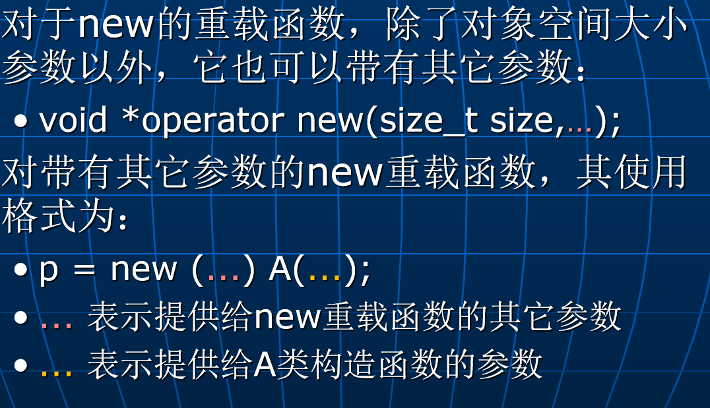

# Lec14: 动态对象空间的自动回收
## 智能指针
可以针对某个类重载“->”、“*”等**用于指针的操作符**，这样就可以把该类的对象当指针来用，实现一种智能指针（smart pointers）。
例如，下面的B类中重载了操作符“->”：
```cpp
B b=&a; //或B b(&a); b是个智能指针对象，它指向a
b->f(); //把b当指针来用（通过b访问对象a的成员f）
```
- 通过智能指针去访问它指向的对象之前能做一些额外的事情。（**在操作符重载函数中实现**）
- 通过智能指针可以**管理**它指向的对象空间，实现动态对象空间的**自动回收**。

### 间接类成员访问操作符“->”的重载
“->”为一个双目操作符：
- 第一个操作数为一个指向类或结构的**指针**。
- 第二个操作数为第一个操作数所指向的类或结构的**成员**。

p->m 等价于 (*p).m，即先对p解引用，得到一个类或结构的对象，然后访问该对象的成员m。

需求：通过一个函数访问某个对象的成员，如何知道在该函数中访问了该对象的成员多少次？
```cpp
class A
{		int x,y;
	public:
		void f();
		void g();
};
void func(A *p) //p是一个普通指针
{  ...... p->f(); ...... p->g(); ...... //通过p访问对象a的成员
}
......
A a;
func(&a); //调用func，a传给它
...... //调用完func后，如何知道在func中访问了a的成员多少次？
```
第一种解决方案：在类A中加一个计数器count，在构造函数中把它初始化为0，在每个成员函数中把它加1
```cpp
class A
{	int x,y;
	int count;
public:
    int z;
	A() { count = 0; ... }
	void f() { count++; ... }
	void g() { count++; ... }
	int num_of_access() const { return count; }
};
void func(A *p) {  ...... p->f(); ...... p->g(); ...... p->z; }
......
A a;
func(&a);
... a.num_of_access() ... //获得对a的访问次数
```
缺点：需要修改类A的定义，增加了类A的复杂性。并且，如果类A中有外界可访问的数据成员（如z），无法对其访问进行计数！

更好的解决方案：定义一个智能指针类
```cpp
class PtrA  //智能指针类
{		A *p_a; //指向A类对象的普通指针
		int count; //用于对p_a指向的对象进行访问计数
	public:
		PtrA(A *p) 
		{	p_a = p; count = 0; 
		}
		A *operator ->()  //操作符“->”的重载函数，按单目操作符重载
		{	count++;  return p_a; 
		}
		int num_of_a_access() const
		{	return count; 
		}
};
void func(PtrA &p) //p是个PtrA类对象！
{  ... p->f(); ... p->g(); ...
}

A a;// 先声明一个A类对象
PtrA b(&a);  //b为一个智能指针，
		  //它指向了a
b->f(); //访问a的成员f，等价于
           //b.operator->()->f();编译器会编译成这样
func(b); //把b传给func
... b.num_of_a_access() ... 
		//获得func对a的访问次数

```

为了完全模拟普通指针的功能，针对智能指针类，还可以重载“*”（对象间接访问）、“[]”、“+”、“-”、“++”、“--”、“=”等操作符：
```cpp
class PtrA  //智能指针类
{		 A *p_a;
  public:
		PtrA(A *p) { p_a = p; }
		A *operator ->() { return p_a; }
		A& operator *()
		{ return *p_a; 
		}
		A& operator [](int i)
		{ return p_a[i]; 
		}
		......
};

A a[10];
A *p=&a[0]; //普通指针
p->f(); //a[0].f();
(*p).f(); //a[0].f();
p[2].f(); //a[2].f();
...... 

PtrA b=&a[0]; //智能指针
b->f(); //a[0].f();
(*b).f(); //a[0].f();
b[2].f(); //a[2].f();
......

```

### 动态对象空间的自动回收
在C++标准库（基于模板实现）提供了一些智能指针类型，其中包括：
- shared_ptr：能对动态对象进行**引用计数**。
- unique_ptr：实现对动态对象的**独占使用**。
- weak_ptr：与shared_ptr配合使用，防止循环引用。

例如，对于下面的类A：
```cpp
class A
{ int x;
public:	
   A(int i) 
   { x = i; 
	 cout << "constructor: x=" << x << endl;
   }	
   ~A() 
   { cout << "destructor: x=" << x << endl; 
   }	
   void f() { cout << "f: x=" << x << endl; }
};
```
用**智能指针**来管理A类的动态对象：
```cpp
shared_ptr<A> p1(new A(1)); //创建第一个动态指针类p1，指向第一个动态对象，其引用计数为1
p1->f(); //调用第一个动态对象的成员函数f，输出： f: x=1
shared_ptr<A> p2(new A(2)); //创建第二个动态指针类p2，指向第二个动态对象，其引用计数为1
p2->f(); //调用第二个动态对象的成员函数f，输出：f: x=2
p1 = p2; //第一个对象的引用计数减1（变成0），第一个对象自动消亡
              //第二个对象的引用计数加1（变成2）


p2 = nullptr;  //第二个对象的引用计数减1（变成1）
p1->f(); //调用第二个动态对象的成员函数f，输出：f: x=2
p1 = nullptr;  //第二个对象的引用计数减1(变成0)，第二个对象自动消亡


unique_ptr<A> p3(new A(3)); //创建第三个动态对象
unique_ptr<A> p4(new A(4)); //创建第四个动态对象
p3 = p4; //Error，第四个对象被p4独占
p3 = nullptr;  //第三个对象消亡
p4 = nullptr;  //第四个对象消亡
```

智能指针消亡时，它指向的动态对象也会消亡：
```cpp
void func()
{ shared_ptr<A> p1(new A(1)); 
   p1->f(); 
   ......
   unique_ptr<A> p2(new A(2));
   p2->f(); 
   ......
} 
int main()
{ func();//p1和p2生存期结束，它们指向的动态对象自动消亡
  ......
}
```

## new与delete的重载
操作符new有两个功能：
- 为动态对象分配空间
- 调用对象类的构造函数
操作符delete也有两个功能：
- 调用对象类的析构函数
- 释放动态对象的空间 

### new的重载
void *operator new(size_t size);
返回类型必须为`void *`
参数`size`表示对象所需空间的大小，其类型为size_t（平台相关的无符号整数类型，可以是unsigned int、unsigned long int等）
例如，下面重载的new除了为对象分配空间外，还把动态对象初始化为全‘0’：
```cpp
#include <cstring>
class A
{		int x,y;
	public:
		void *operator new(size_t size)
		{	void *p=malloc(size); //调用系统堆空间分配操作。
			memset(p,0,size); //把申请到的堆空间初始化为全“0”。
			return p;
		}
		......
};
```
上面重载的new与系统提供的差别在于：它可以为一个**没有定义任何构造函数的动态对象**提供初始化！

例如，下面重载的new在非“堆区”为动态对象分配空间：
```cpp
#include <cstring>
class A
{		int x,y;
	public:
		A(int i, int j) { x=i; y=j; }
		void *operator new(size_t size, void *p)
		{ return p; //p是空间上为动态对象的分配空间地址
		}
};


char buf[sizeof(A)];
A *p=new (buf) A(1,2); //把buf传给new重载函数的参数p
                        //在buf中创建动态对象

p->~A(); //通过显式调用析构函数让p指向的对象消亡。
		      //不能用系统的delete，可以用自己重载的delete
```

### delete的重载
一般来说，如果对某个类重载了操作符new，则相应地也要重载操作符delete。
操作符delete也必须作为静态的成员函数来重载（static可以不写），其格式为： 
	void operator delete(void *p, size_t size);
返回类型必须为void。
第一个参数类型为void *，指向对象的内存空间。
第二个参数可有可无，如果有，则必须是size_t类型。

### 例：重载操作符new与delete来管理程序中某类动态对象的堆空间

可以针对某个类，通过重载new和delete**自己管理**动态对象的空间分配和释放，以提高效率。
重载new：
- 第一次创建该类的动态对象时，先从系统管理的堆区中申请一块**大的空间**，里面能放n个该类对象。
- 然后把上述大空间分成若干小块，每个小块的大小为该类一个对象的大小，用链表把这些小块管理起来，形成**自由空间链表**。
- 每次创建该类的动态对象时，从上述自由空间链表中为其分配空间。

重载delete：
- 该类的动态对象消亡时，把对象的空间归还到new操作中申请到的大空间（**自由空间链表**）中，**而不是归还到系统的堆区中**。

例如：
```cpp
#include <cstring>
class A
{		...... //类A原有的成员说明
	public:
		static void *operator new(size_t size);
		static void operator delete(void *p);
	private:
		A *next; //用于组织A类对象自由空间链表
		static A *p_free; //用于指向A类对象的自由空间链表头，由于是被共享的，所以要声明为静态成员
};
A *A::p_free=NULL;
const int NUM=32; //每次从系统堆区申请NUM个A类对象的空间
//重载操作符new
void *A::operator new(size_t size)
{	if (p_free == NULL) //创建第一个A类动态对象
	{	//申请NUM个A类对象的大空间。
	    p_free = (A *)malloc(size*NUM);  //一个动态数组
		//在大空间上建立自由空间链表（链表结点初始是连续的）
		for (int i=0; i<NUM-1; i++)
		   p_free[i].next = &p_free[i+1];
		p_free[NUM-1].next = NULL;//构造链表
	}
    //从链表中给当前动态对象分配空间
	A *p=p_free;
	p_free = p_free->next;
	memset(p,0,size); //可由构造函数完成
	return p;
}
//重载操作符delete
void A::operator delete(void *p)
{	//把p指向的空间还到自由空间链表中
   ((A *)p)->next = p_free;//让p指向的对象的next指向现在空的第一个节点
	p_free = (A *)p;//把原先指向第一个空的节点的指针p_free改为p
}

A *q1=new A;
A *q2=new A;
delete q1;
```
在创建动态对象时，一大块用完了，根据new的重载函数，它将会申请第二大块，并再次构建自由空间链表：

要还必须以一大块的首地址的形式还给系统堆区

动态对象数组的创建与撤销
```cpp
A *p=new A[10];
... p[0]、p[1]、...、p[9] ...
delete []p; //“[]”不能漏掉！否则只调用第一个元素的析构函数。delete一个数组的时候，必须整个数组的形式归还，p指向第一个元素的地址
```
上述操作将调用下面的重载函数（隐式或自定义）：
```cpp
void *operator new[](size_t size);
void operator delete[](void *p);
```
当类（或基类和成员对象类）中有析构函数时，传给new[]重载函数的参数size的实际值会比对象数组需要的空间多4个字节，用于**存储元素个数**。

