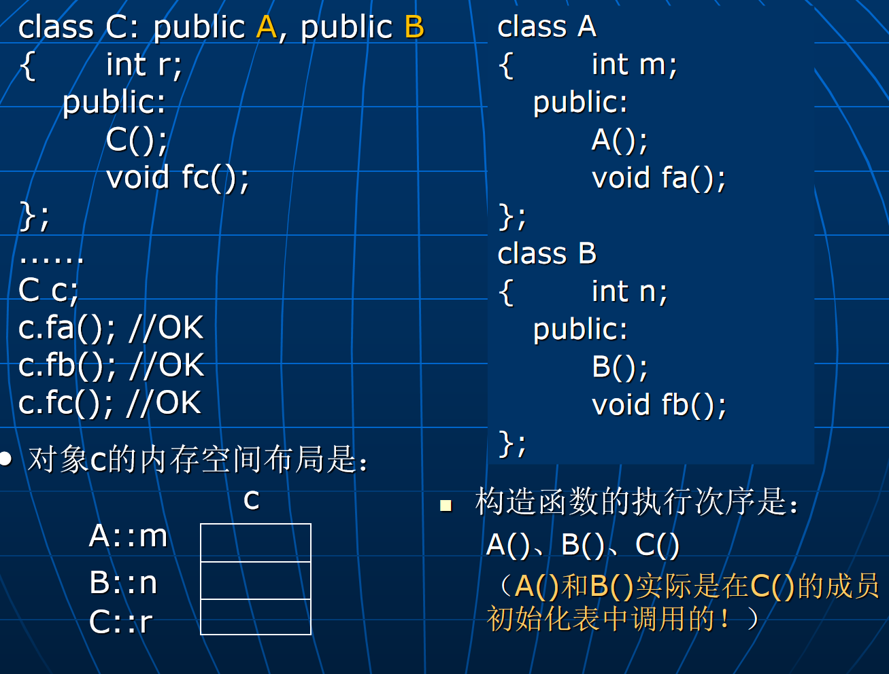
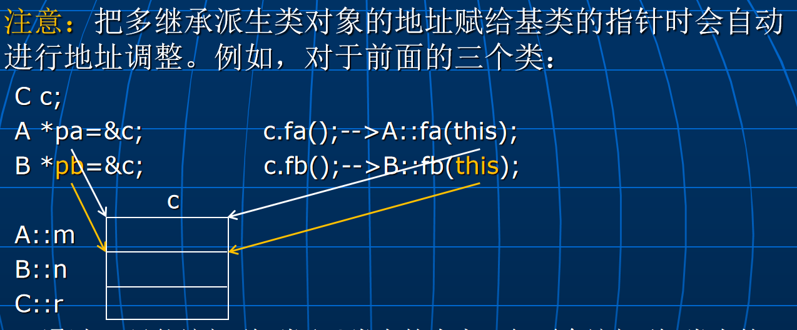
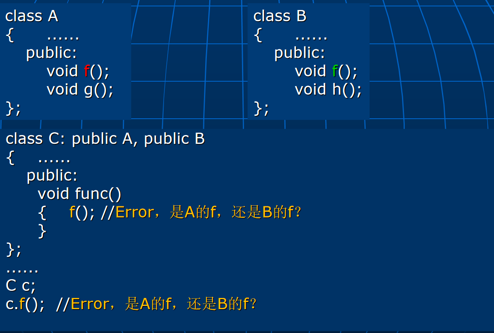

# Lec18: 多继承
## 必要性
对于下面的两个类A和B：
```cpp
class A
{		int m;
	public:
		void fa();
};
class B
{		int n;
	public:
		void fb();
};
```
如何定义一个类C，它包含**A和B的所有成员**，另外还拥有**新的数据成员**r和**成员函数**fc？

### 用单继承实现
```cpp
class C: public A //让C从A继承
{		int n,r; //把B类中的n复制过来
	public:
		void fb(); //把B类中的fb复制过来
		void fc();
};
//或者
class C: public B //让C从B继承
{		int m,r; //把A类中的m复制过来
	public:
		void fa(); //把A类中的fa复制过来
		void fc();
};
```
这样有什么缺点？
- 概念混乱：导致A和B之间增加了层次关系
- 易造成不一致：A中的m、fa与C中的m、fa可能会不一致。
- 不能完全实现子类型：只有A和B中某一类对象能被C类对象替代，另外一个不行

### 用成员对象实现
```cpp
class C
{		A a;
		B b;
		int r;
	public:
		void fa() { a.fa(); }  //重新实现fa
		void fb() { b.fb(); }  //重新实现fb
		void fc();
};
```
但是这样不能实现**子类型**：程序中需要A和B类对象的地方**都不能用C类对象去替代**。

### 用**多继承**实现
```cpp
class C: public A, public B
{		int r;
	public:
		void fc();
};
```
多继承是指派生类可以有**一个以上的直接基类**。
继承方式及访问控制的规定同单继承，派生类拥有**所有基类的所有成员**。
基类的声明次序决定派生类对象对基类数据成员的**存储安排**和对基类构造函数/析构函数的**调用次序**。

这个图里内存存储的顺序就是按照基类声明的顺序

public多继承的派生类与它的各个基类之间是子类型关系，各个**基类**的指针或引用可以指向或引用**派生类对象**

分别指向c里面A的部分和B的部分，因为指针类型不一样

### 多继承带来的问题
单继承带来的是树形结构，而多继承会导致变成图结构，非常复杂
语言特征复杂化，编译程序的难度加大，消息绑定复杂化

两个基本问题：
- 名冲突问题
- 重复继承问题

#### 名冲突问题



#### 重复继承问题
