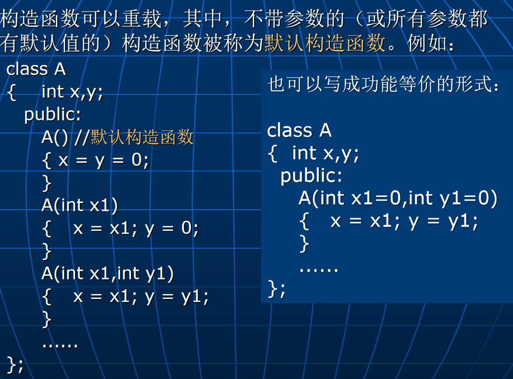

# Lec6: 构造函数和析构函数
当一个对象创建时，它将获得一块内存空间，该内存空间用于存储对象数据成员的值。在使用对象前，需要对对象内存空间中的数据成员进行初始化。
在以前的C++中，无法在class中直接为数据成员赋初值，只能在构造函数中对数据成员进行初始化。
## 构造函数


```cpp
class A
{		......
	public:
		A();
		A(int i);
		A(const char *p);
};

A a[4];    //调用对象a[0]、a[1]、a[2]、a[3]的默认构造函数。
A b[5]={A(),A(1),A("abcd"),2,"xyz"}; 
		//或A b[5]{A(),A(1),A("abcd"),2,"xyz"}; 
		//调用：b[0]的A()、b[1]的A(int)、b[2]的A(char *)、
		//b[3]的A(int)和b[4]的A(char *)
```
通过类的构造函数也可以用来创建一些临时对象。例如：
```cpp
void f(A a) { ...... }

f(A(10)); //创建一个临时对象传给函数f
```
注意：对象创建之后不能再显式调用构造函数对对象进行初始化。
```cpp
A a; //调用默认构造函数
a.A(); //错误，不能再调用构造函数
```

### 成员初始化表
```cpp
class A 
{		int x;
     const int y;
     int &z=x;
     A()
     { x = 0;    //OK
	     y = 1;    //Error, const成员不能在构造函数中初始化
		   z = &x;  //Error, 引用成员不能在构造函数中初始化
		   z = x;  //Error
     }
};
```
如何对const常量和引用类型的成员进行初始化？
可以在构造函数的函数头和函数体之间加入一个**成员初始化表**来对常量和引用数据成员进行初始化。
```cpp
class A
 {  int x;
	  const int y;
	  int& z;
  public:
	  A(): z(x),y(1)  //成员初始化表
	  { x = 0;
	  }
};
```
在成员初始化表中，成员的书写次序并不决定它们的初始化次序，它们的初始化次序由它们在**类定义中**的描述次序来决定。
次序为什么很重要？次序错误可能会引起程序错误。
```cpp

```
## 析构函数
一个对象**消亡**时，系统在收回它的内存空间之前，将会自动调用对象类中的析构函数。
析构函数的名称是在类名前加上一个波浪号（~），它不带任何参数，也没有返回值。
```cpp
class A
{
public:
	~A()
	{
		//析构函数的函数体
	}
};
```
可以在析构函数中完成对象被删除前的一些清理工作。
一般情况下，类中不需要自定义析构函数，但如果对象创建后，自己又**额外申请了资源**（如：额外申请了内存空间），则可以自定义析构函数来归还它们。


析构函数除了在对象消亡时会被自动调用外，也可以在对象生存期内**显式调用**，这与构造函数不同。
这时并不是让对象消亡，而是暂时归还对象额外申请的资源。
因此，在析构函数中将成员变量设为空值（如int型设为0）并且将指针成员置为NULL是一个好习惯。
```cpp
String s1("abcd");
s1.~String(); //把字符串s1清空，对象并未消亡！
... s1 ... //仍然可以使用对象s1
```

在创建包含成员对象的对象时，除了会自动调用本身类的构造函数外，还会**自动去调用成员对象类的构造函数**，析构函数也是如此。
如果要调用成员对象类的非默认构造函数，需要在包含成员对象的对象类的构造函数成员初始化表中显式指出
```cpp
class A
{   int x;
   public:
	 A() { x = 0; }
	 A(int i) { x = i; }
};
class B
{   A a;
    int y;
   public:
     B() { y = 0;}
     B(int i) { y = i; } 
     B(int i, int j): a(j) { y = i; } 
};
B b0; //调用B()和A()：b0.y=0；b0.a.x=0
B b1(1); //调用B(int)和A()：b1.y=1；b1.a.x=0
B b2(1,2); //调用B(int,int)和A(int)：b2.y=1；b2.a.x=2
......
//b0、b1、b2消亡时，会分别去调用B和A的析构函数
```
包含成员对象的对象创建时，
- 先调用**本身类**的构造函数，但在**进入函数体之前**，会去调用**成员对象类**的构造函数，**然后再执行**本身类构造函数的函数体！
- 也就是说，构造函数的成员初始化表（即使没显式给出）中有对成员对象类的构造函数的调用代码，是编译器加上的
- 若包含多个成员对象，这些成员对象构造函数的调用次序则按它们在**本对象类中的说明次序**进行。