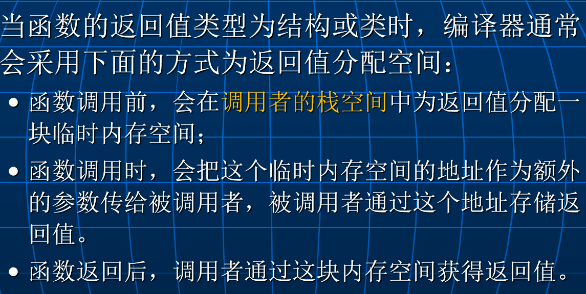
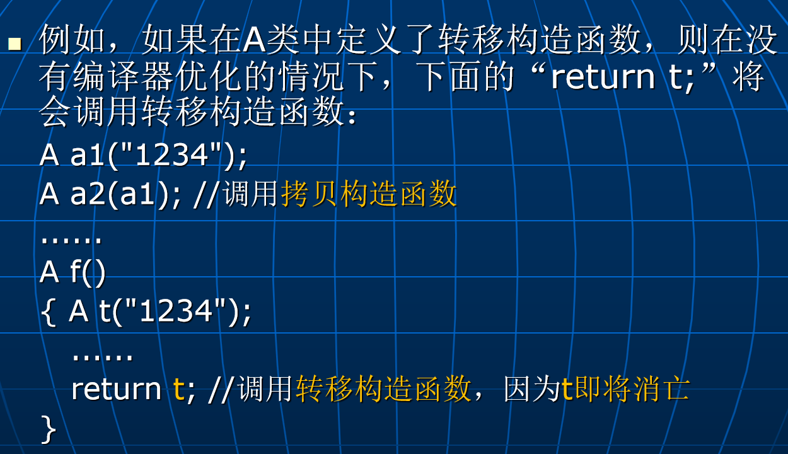

# Lec7: 对象的拷贝与转移初始化
## 拷贝构造函数
在创建一个对象时，如果用另一个同类的对象对其进行初始化，将会去调用对象类中的一个特殊构造函数--拷贝构造函数。
拷贝构造函数的参数类型为本类的引用。
拷贝构造函数的参数必须是引用类型，否则会导致无限递归调用。
```cpp
class A
{	......
	public:
		A();  //默认构造函数
		A(const A& a);  //拷贝构造函数
}; 
```
在下面三种情况下，会去调用拷贝构造函数：
1. 创建对象时显式指出用另一个同类对象**对其初始化**。
2. 把对象作为**值参数**传给函数，先创造形式参数的对象，再调用拷贝构造函数来初始化。
3. 把对象作为函数的**返回值**时，先创造返回值的对象，再调用拷贝构造函数来初始化。

如果在类中没有定义拷贝构造函数，编译器会自动生成一个默认的拷贝构造函数，按成员逐一拷贝。
对成员对象，调用其拷贝构造函数，类似递归。

### 自定义拷贝构造函数
一般情况下，编译程序提供的隐式拷贝构造函数的行为足以满足要求，类中不需要自定义拷贝构造函数。
但在一些特殊情况下，必须要自定义拷贝构造函数，否则，将会产生设计者未意识到的严重程序错误。 
```cpp
class String
{	   int len;
	   char *str;
	public:
		String(const char *s) 
		{ len = strlen(s); 
		   str = new char[len+1]; 
		   strcpy(str,s); 
		}
		~String() { delete []str; len=0; str=NULL; }
};
......
String s1("abcd");
String s2(s1);
```
隐式的拷贝构造函数将会使得s1和s2的成员指针str指向**同一块内存区域**！
可能引起的问题：
- 如果对一个对象（s1或s2）操作之后修改了这块空间的内容，则另一个对象（s1或s2）也会受到影响。
- 当对象s1和s2消亡时，将会分别去调用它们的析构函数，这会使得同一块内存区域将被归还两次，从而导致程序运行错误。

系统提供的隐式拷贝构造函数实施的是**浅拷贝**（shallow copy）：对于指针成员，只拷贝**指针的值**，**不拷贝它指向的值**。

为了解决上面的问题，可以在类String中自定义一个拷贝构造函数来实现**深拷贝（deep copy）**
```cpp
String::String(const String& s)
{	len = s.len;
	str = new char[len+1]; //申请一块新空间
	strcpy(str,s.str); //拷贝指针指向的值
}
```


注意：自定义的拷贝构造函数**不会自动调用**成员对象类的**拷贝构造函数**，而是调用成员对象类的**默认构造函数**。
必须在自定义拷贝构造函数的成员初始化表中显式指出调用成员对象类的拷贝构造函数。

可行但效率不高，因为会先调用成员对象类的默认构造函数，再调用拷贝构造函数。

### 拷贝构造存在的问题
当用一个**临时或即将消亡**的对象去初始化另一个同类的对象时，自定义的拷贝构造函数的效率有时是不高的。
```cpp
class A
{ char *p;
public:
  A(const char *str) 
  { p = new char[strlen(str)+1]; //申请内存空间
     strcpy(p,str); 
  }
  A(const A& x) //拷贝构造函数
  { p = new char[strlen(x.p)+1]; //申请内存空间，避免指向同一个地址
     strcpy(p,x.p); //内容复制
  }
  ~A() 
  { if (p != NULL) delete[]p; //归还内存空间
     p = NULL; 
  }
  void g() { ...... }
};
```
在编译器没有优化的情况下，下面的代码效率不高：
```cpp
A f()
{ A t("1234"); //创建局部对象t(调用构造函数申请空间)
   ......
   return t; //创建返回值对象(调用拷贝构造函数申请空间,内容复制)
                //然后，局部对象t消亡（调用析构函数归还t申请的空间）
}
int main()
{ ......
   f().g();   //使用函数f的返回值对象，然后，
                //该返回值对象消亡（调用析构函数归还空间）
   ......
}
```
函数f中，局部对象t在调用拷贝构造函数时，**申请了两块内存空间**，也就是一次返回值对象，一次局部对象t，而且还要进行一次内容复制。
在函数f返回时，局部对象t消亡，调用析构函数归还t申请的空间。
为什么不直接将t申请的空间**转移**给返回值对象的空间呢？这样可以省去返回值对象申请空间、内容复制以及对象t消亡归还空间的开销。

## 返回值优化(Return Value Optimization, RVO)
当函数返回一个对象时，有些情况下，编译器会进行返回值优化。
例如，在编译器优化的情况下，刚才的“return t;”不会创建返回值对象，而是直接把t返回：
**问题**：t是局部对象，函数返回后其生存期就结束了，应该是不能再使用它的，那优化是如何实现的？如何保证函数返回之后t的空间仍然有效？

如果函数的返回值是基本数据类型（int、char、float、double等），会在cpu寄存器中分配空间来存放返回值。

如果函数把一个与返回值**同类型**的局部对象（如前面例子中的对象t）返回，编译器有时会**优化**这个局部对象的空间分配：
- 先在调用者的栈空间中为返回值对象分配空间，然后不额外为局部对象t分配空间，而是把返回值对象的空间分配给它。
- 这样，返回值对象与这个局部对象就是**同一个对象**，函数返回时直接把这个局部对象返回，而不会去调用拷贝构造函数再创建返回值对象。
- 由于这个局部对象的空间是在**调用者的栈空间中**，函数返回后，它仍然有效！

如果函数中有**多个**与返回值同类型的局部对象，并且函数中**根据不同的情况返回不同的局部对象**，则编译器**无法进行返回值优化**！函数返回时仍然会创建返回值对象，并调用拷贝构造函数对其进行初始化。

在这种情况下，还想提高效率，可以使用**转移构造函数**。

## 转移构造函数
可以在类中定义一个转移构造函数(move constructor)，其参数类型为本类的右值引用。
```cpp
A(A&& x); //参数为本类的右值引用类型：&&
```
右值引用：只接受右值，也就是临时对象或者即将消亡的对象。
当用一个临时对象或即将消亡的对象去初始化另一个对象时，将会去调用**转移构造函数**进行对象初始化。
**注意**：如果对象类中没有自定义转移构造函数，系统不会提供隐式转移构造函数！

可在转移构造函数中实现资源的转移。例如：
```cpp
A(A&& x)
{ p = x.p; //把参数对象x的p所指向的空间作为
               //新对象的p所指向的空间（资源转移）
   x.p = NULL; //使得参数对象x的p不再指向原来的空间，防止他析构的时候归还这块空间
}
```
这块跟拷贝构造不同，拷贝构造没有资源转移，而是资源复制，他并没有把原来所指的空间设为null。
有了上述的转移构造函数之后，前面例子中的“return t;”就会去调用它，从而实现：
- 不再为返回值对象额外申请空间和内容复制
- 对象t消亡时也不再归还原来申请的空间

如何把一个左值对象的资源转移给另一个对象？
可以用STL中的函数move把一个左值类型转换成右值类型。例如：
```cpp
#include <utility> //包含move函数的头文件
void f(A x) { ...... }
......
A a; //a为一个左值对象
f(a); //用拷贝构造创建x，a的资源仍然存在
f(std::move(a)); //把a转成右值的时候，就会用转移构造创建x
			     //a不再拥有资源！
```
move函数**并不真的移动什么东西**，它只是把一个**左值转换成右值**，从而使得这个对象可以调用转移构造函数。