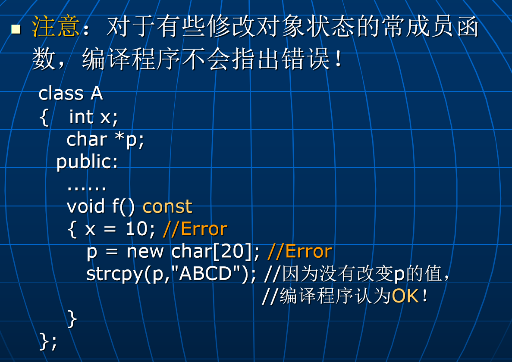

# Lec8: 常成员函数及静态成员
## 获取和改变对象的状态
在程序运行的不同时刻，一个对象可能会处于不同的**状态**，由数据成员的值体现。
可以把类中的成员函数分成两类：
1. 获取对象状态（不改变数据成员的值）
2. 改变对象状态（改变数据成员的值）

## 常成员函数
为了防止在一个获取对象状态的成员函数中无意中修改对象数据成员的值，可以把它说明成**常成员函数**。
常成员函数在声明时，在函数名后面加上`const`关键字。
```cpp
class Date
{	public:
		void set(int y, int m, int d); 
	  int get_day() const; //常成员函数
     int get_month() const; //常成员函数
     int get_year() const; //常成员函数
  ......
}; 
void Date::set(int y, int m, int d) { year=y; month=m; day=d; }
int Date::get_day() const { return day; }
int Date::get_month() const { return month; }
int Date::get_year() const { return year; }
```
编译器一旦发现在常成员函数中修改数据成员的值，就会报错。

只修改了p指向的值，没有修改p本身的值，编译器不会报错。

这里，d这个对象是一个常对象，只能调用他的常成员函数。

## 同类对象如何共享数据？方案一：使用全局变量


## 方案二：使用静态数据成员