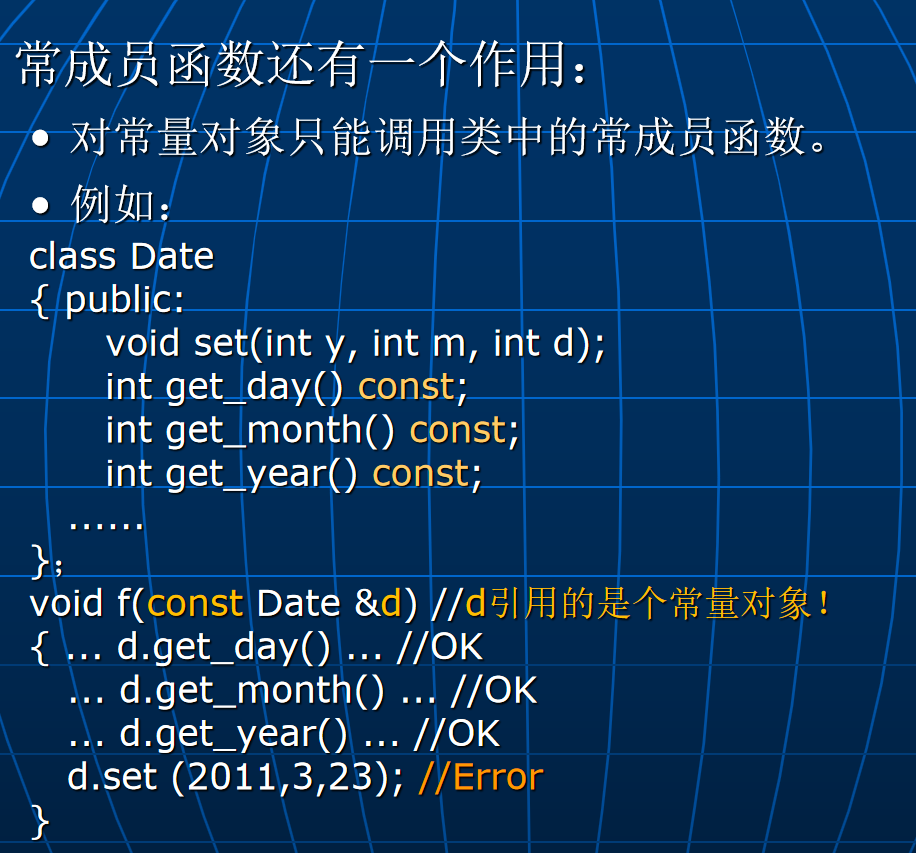

# Lec8: 常成员函数及静态成员
## 获取和改变对象的状态
在程序运行的不同时刻，一个对象可能会处于不同的**状态**，由数据成员的值体现。
可以把类中的成员函数分成两类：
1. 获取对象状态（不改变数据成员的值）
2. 改变对象状态（改变数据成员的值）

## 常成员函数
为了防止在一个获取对象状态的成员函数中无意中修改对象数据成员的值，可以把它说明成**常成员函数**。
常成员函数在声明时，在函数名后面加上`const`关键字。
```cpp
class Date
{	public:
		void set(int y, int m, int d); 
	  int get_day() const; //常成员函数
     int get_month() const; //常成员函数
     int get_year() const; //常成员函数
  ......
}; 
void Date::set(int y, int m, int d) { year=y; month=m; day=d; }
int Date::get_day() const { return day; }
int Date::get_month() const { return month; }
int Date::get_year() const { return year; }
```
编译器一旦发现在常成员函数中修改数据成员的值，就会报错。

只修改了p指向的值，没有修改p本身的值，编译器不会报错。

这里，d这个对象是一个常对象，只能调用他的常成员函数。

## 同类对象如何共享数据？方案一：使用全局变量
```cpp
int x=0; //x是全局变量，它表示共享的数据
class A
{ int y;
   ......
   void f()   { y = x; x++; ......   } //访问共享的x
} a,b;
```
不足之处：
- 共享的数据与对象之间缺乏显式的联系，不查看f的实现代码，看不出联系
- 数据缺乏保护

## 方案二：使用静态数据成员
```cpp
class A
{ int y;
   ......
   static int x; //x是静态数据成员（这里是声明），它表示共享的数据
   void f()   { y = x; x++; ......   } //访问共享的x
};
int A::x=0; //静态数据成员的定义及初始化
......
A a,b;
a.f();
b.f();
//上述操作中使用的是同一个x！
x++; //Error，不通过A类对象不能访问x！
```
注意：类的静态数据成员对该类的**所有对象只有一个拷贝**，被所有对象共享。
非静态的数据成员，每个对象都有自己的拷贝。

## 静态成员函数
```cpp
lass A
{		int x,y;
		static int shared;
	public:
		A() { x = y = 0; }
		static int get_shared() //静态成员函数
     { return shared; 
     }
		......
};
int A::shared=0;
```
静态成员函数**只能访问静态数据成员**，不能访问非静态数据成员，并且没有隐藏的**this**指针。

静态成员除了通过对象来访问外，也可以直接通过类来访问。
```cpp
A a;
a.get_shared();//通过对象访问
A::get_shared();//通过类访问
```

可以把类看成是对象，那么类对象的类又是什么？
把类中**所有非静态成员去掉**后得到的类就是类对象所属的类。
